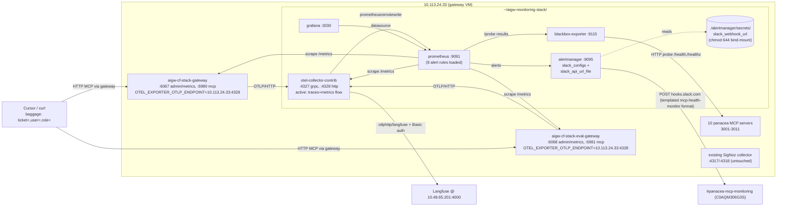
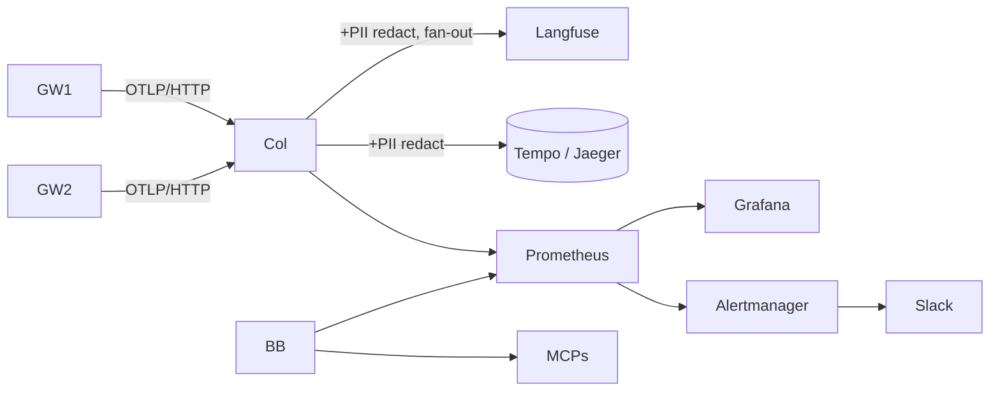

# AI Gateway telemetry rollout tracker

Single page to track every observability/telemetry workstream for the AI
gateway (Envoy AI Gateway fork) running on `10.113.24.33`. Update the
status emoji + the per-task checkbox as work moves; do not delete
historical sections, add new ones as new phases come up.

| Last updated | 2026-04-27 (P5 resource-usage observability + Slack resolved-path fix) |
|---|---|
| Maintainer | Mohit Gurnani |
| Source-of-truth plans | `aigw-otel-langfuse-followups_e274c333.plan.md`, `address_sohham_pr_feedback_b59bf117.plan.md`, `aigw-phase2-monitoring-stack_ef46ce8e.plan.md` |
| Gateway VM | `10.113.24.33` (`nutanix@`) |
| Langfuse VM | `10.48.65.201:4000` |
| Active gateway image | `local/ai-gateway-cli:cf-stack` (sha `c66853854e4f`) rebuilt 2026-04-27 22:15:16 UTC from `mohit/otel-langfuse-native-attrs` head `90bac66d` (P3f Phase A) — both `aigw-cf-stack-gateway` and `aigw-cf-stack-eval-gateway` recreated against this image at 22:16:37 UTC and report `(healthy)`. Replaces the prior `edcd0cfcae5e` image. |
| Active OTLP path | gateway → `otel-collector-contrib` (`:4328`) → Langfuse (P3d cutover live as of 2026-04-27 ~20:13 UTC; P3e input/output payloads now flow through the same pipe) |
| Repo home for monitoring stack | `panacea-ai-gateway/deploy/monitoring/` ([PR #12](https://github.com/nutanix-core/panacea-ai-gateway/pull/12) `mohit/aigw-monitoring-stack` + [PR #13](https://github.com/nutanix-core/panacea-ai-gateway/pull/13) `mohit/aigw-monitoring-dashboards`, both stacked on PR #10) |

## At-a-glance status

| Phase | Title | Status | Owner | Branch / Artifact |
|---|---|---|---|---|
| P1 | Strip `mcp-health-monitor` auto-restart + `pause_state` migration | DONE | Mohit | `mohit/strip-mcp-monitor-auto-restart` (PR #159 + follow-up) |
| P3a | Langfuse self-host + dual-gateway OTLP export | DONE | Mohit | host: `~/aigw-otel-langfuse-backup/` |
| P3b | Promote OTel attrs to Langfuse-native dimensions (`user.id`, `langfuse.tags`, `tool.name`, `mcp.backend.name`, `session.id`) | DONE | Mohit | [PR #10](https://github.com/nutanix-core/panacea-ai-gateway/pull/10) — branch `mohit/otel-langfuse-native-attrs` (commit `ad29a7a7`) |
| P3c | Cursor MCP static-baggage hook + 13-widget Langfuse dashboard | DONE | Mohit | `~/.cursor/mcp.json` per-user; Langfuse dashboard `cmohddu5o0009lb07k127lwo6` |
| P2 | Passthrough monitoring stack (otel-collector + prometheus + grafana + blackbox) | DONE | Mohit | host: `~/aigw-monitoring-stack/` |
| P3d | Cutover gateways from direct Langfuse → local collector → Langfuse | DONE | Mohit | host: `~/aigw-monitoring-stack/cutover/flip-to-collector.sh` (script bug fixed: URL-encoded the Prom safety guard) |
| P3e | Capture MCP CallTool / GetPrompt / ReadResource input + JSON-RPC response output as Langfuse-native `input.value` / `output.value` (fix empty trace I/O) | DONE | Mohit | [PR #11](https://github.com/nutanix-core/panacea-ai-gateway/pull/11) — branch `mohit/lf-input-output-capture` (commit `f796f6c9`, stacked on PR #10) |
| P3f | Phase A: capture `client.address` / `client.address.kind` / `auth.kind` and fall `user.id` back to `"ip:<addr>"` when no baggage `user` (Phase B sunset wired in once Okta lands) | DONE | Mohit | [PR #10](https://github.com/nutanix-core/panacea-ai-gateway/pull/10) — branch `mohit/otel-langfuse-native-attrs` (Phase A commit on top of `ad29a7a7`) |
| P4 | Alertmanager + alert rules + native Slack webhook, retire `mcp-health-monitor` | DONE | Mohit | host: `~/aigw-monitoring-stack/{alertmanager,prometheus/rules}/`. `severity=critical|warning` routes both fire into `#panacea-mcp-monitoring` via Alertmanager's native `slack_configs` using a Slack Incoming Webhook URL stored as a chmod-644 bind-mounted secret (`alertmanager/secrets/slack_webhook_url`). Message template mirrors the retired `mcp-health-monitor` format (`:large_orange_diamond:` / `:rotating_light:` / `:white_check_mark:` + `Server / Level / Error / Since` block). Legacy `mcp-health-monitor` `docker rm`'d 2026-04-27; the interim `slack-relay` Flask sidecar was also retired the same day once the webhook URL became available. |
| P4a | Slack `RECOVERED` notification path — `group_interval` lowered from `5m` → `1m` so resolved messages land within ~90s of an alert clearing | DONE | Mohit | [PR #12](https://github.com/nutanix-core/panacea-ai-gateway/pull/12) — branch `mohit/aigw-monitoring-stack` (`alertmanager/alertmanager.yml`). End-to-end validation: explicit-resolve push → counter `alertmanager_notifications_total{integration="slack"}` ticks twice (firing + resolved). |
| P5 | Resource-usage observability stack (cAdvisor + node-exporter + process-exporter) + new "MCP & Gateway Resource Usage" Grafana dashboard mirroring the layout of `~eng/panacea-ai-analysis/mcp_usage_dashboard.html` | DONE | Mohit | [PR #12](https://github.com/nutanix-core/panacea-ai-gateway/pull/12) `mohit/aigw-monitoring-stack` (compose + scrape jobs + process-exporter group rules) and [PR #13](https://github.com/nutanix-core/panacea-ai-gateway/pull/13) `mohit/aigw-monitoring-dashboards` (`grafana/dashboards/mcp-usage.json`). Adds per-MCP CPU/RAM/FD/network/restart panels driven by 22 `process-exporter` cmdline-keyed groups (12 MCPs + 3 gateways + 2 content filters + sidecars). |
| P6 | OTel Collector hardening (PII redaction processor, fan-out to Tempo/Jaeger if needed) | NOT STARTED | unowned | n/a (was P5 — renumbered after P5 resource-usage work shipped) |

Legend: DONE / IN PROGRESS / NOT STARTED / BLOCKED.

## Rollout summary — what is deployed and how it works

This section is the executive summary of everything in P1 + P3a + P3b + P3c
+ P2. New readers should be able to skim this section, look at the
"Architecture today" mermaid below, and know enough to operate the stack
without reading every phase block.

### What we have today

We turned the AI gateway from a black box into a debuggable, ticket-aware
LLM trace + metrics pipeline with a shippable monitoring stack co-located
on the gateway VM:

1. **Two gateway instances, environment-tagged.** `aigw-cf-stack-gateway`
   on `:6980` is the runtime path tagged `deployment.environment=dev` /
   `gateway.role=runtime`. `aigw-cf-stack-eval-gateway` on `:6981` is the
   eval/PoC path tagged `deployment.environment=eval` /
   `gateway.role=eval`. Every span carries those resource attributes, so
   Langfuse can split widgets by gateway with no extra code.
2. **Self-hosted Langfuse** at `http://10.48.65.201:4000` ingests OTLP/
   HTTP+protobuf directly from both gateways. Auth is HTTP Basic with the
   project `pk:sk` pair living only on the gateway env (until P3d moves
   it onto the collector).
3. **Trace-context + baggage propagation.** Clients send W3C
   `traceparent` to keep the trace id stable across hops, and W3C
   `baggage: ticket=...,user=...,role=...` for cross-cutting tags. The
   gateway extracts those, writes them to spans, and re-injects both into
   the MCP `_meta` envelope and outbound HTTP headers so downstream
   backends inherit them.
4. **Native Langfuse-dimension promotion (PR #10, this thread).** The
   three baggage values plus the tool/backend names are now also written
   under the keys Langfuse indexes for dashboard group-by/filter:
   - `user.id` from baggage `user`
   - `langfuse.tags[]` from baggage `ticket`/`role` and from
     `RecordRouteToBackend` (`backend:<name>`)
   - `tool.name` (OpenInference) dual-emitted alongside `mcp.tool.name`
   - `mcp.backend.name` as a span attribute, in addition to the existing
     event of the same name
   The original `mcp.client.*` and `mcp.tool.name` attrs are unchanged so
   non-Langfuse consumers and existing unit tests keep working.
5. **Cursor MCP baggage hook.** Every entry in `~/.cursor/mcp.json` that
   points at the runtime/eval gateway carries
   `headers: {"baggage": "user=<dev>,role=engineer"}`, so any tool call a
   developer makes from Cursor — NuRAG, Playwright, Atlassian, etc. — is
   automatically tagged with their identity. Per-ticket scoping is still
   a manual curl pattern (or the `find-mcps-for-ticket.py` CLI) since
   Cursor's static config can't change per-session.
6. **Operational dashboard.** Langfuse dashboard `cmohddu5o0009lb07k127lwo6`
   (folder "AI Gateway", titled `ai-gateway`) has 13 widgets covering
   trace volume by env, MCP method mix, p95 latency, error level mix,
   per-tool / per-backend breakdowns, and most-active users. Widgets that
   require P3b attributes (#5, #7, #8, #10, #11, #13) start to populate
   once a CallTool wave lands; the rest (#1–4, #6, #9, #12) work on the
   pre-existing schema.
7. **Per-call input + output payloads captured natively (PR #11, this
   thread).** The previous "Input" and "Output" panels in the Langfuse
   trace UI were empty for `CallTool`/`GetPrompt`/`ReadResource` — only
   the method name and tool name landed. The fix wires three things
   together:
   - `internal/tracing/mcp.go` now JSON-encodes `params.Arguments` (or
     `params.URI` for `ReadResource`), truncates to 8 KiB, and dual-emits
     `langfuse.observation.input` + OpenInference `input.value` +
     `input.mime_type=application/json`.
   - `tracingapi.MCPSpan` gains a new `RecordResponseOutput([]byte)`
     method; the `mcpSpan` impl marshals the JSON-RPC `result` (or empty
     bytes on a JSON-RPC error response) and dual-emits
     `langfuse.observation.output` + `output.value` + `output.mime_type`,
     guarded by a one-shot flag so duplicate proxy paths don't double-
     emit.
   - `internal/mcpproxy/handlers.go` stashes the active span on
     `mcpRequestContext.currentSpan` at request-decode time, then a new
     `recordSpanOutput(*jsonrpc.Response)` helper is invoked from both
     the JSON and SSE response paths so payload capture survives the
     SSE-only backends (atlassian, slack) that the gateway proxies.
   Net effect: the Input and Output panels in Langfuse traces now show
   the actual tool arguments and the actual JSON-RPC result, including
   for diamond/nurag/supportgpt — all three were empty before this PR.
8. **Phase-2 monitoring stack** (`~/aigw-monitoring-stack/`) runs four
   dormant-but-passing-through containers next to the gateways:
   `otel-collector-contrib` on `:4327`/`:4328`, `prometheus` on `:9091`,
   `grafana` on `:3030`, `blackbox-exporter` on `:9115`. The collector is
   wired with the same Langfuse Basic-auth exporter so we can flip the
   gateway env in one diff (P3d) and start enforcing memory/queue limits
   + future PII redaction without re-instrumenting the gateway. Until
   that flip, the gateways still talk to Langfuse directly and the
   collector is idle except for self-scrape. Prometheus is already
   collecting useful data: 14/14 targets up, 9/10 MCP probes UP (jita
   pre-existing failure documented below), Grafana renders the starter
   "AI Gateway Overview" dashboard.

### How a request flows end-to-end (today's path)

```
Cursor / curl
  └─ HTTP POST /mcp { ..., _meta: { traceparent, baggage } }
     └─ aigw-cf-stack[-eval]-gateway (:6980 or :6981)
        ├─ tracing.StartSpanAndInjectMeta()
        │   • extracts traceparent + baggage from headers/_meta
        │   • promotes baggage → mcp.client.user/ticket/role  (existing)
        │   • promotes baggage → user.id, langfuse.tags        (NEW, PR #10)
        │   • re-injects traceparent + baggage on outbound calls
        ├─ MCP method handler (Initialize / CallTool / ListTools / …)
        │   • CallTool: writes mcp.tool.name + tool.name        (NEW, PR #10)
        │   • RecordRouteToBackend: writes mcp.backend.name attr +
        │     appends backend:<name> to langfuse.tags           (NEW, PR #10)
        ├─ proxies the request to one (CallTool) or all
        │   (Initialize/ListTools) of the 10 MCP backends 3001–3011
        └─ exports OTLP/HTTP+protobuf → http://10.48.65.201:4000/api/public/otel
                                       └─ Langfuse web → ClickHouse
```

Langfuse dashboards then group/filter by the native dimensions the gateway
just wrote, and developers can reverse-lookup any ticket/user with the
existing `find-mcps-for-ticket.py` CLI or by filtering Tags in the UI.

### What each new component is for

| Component | What it does | Why it exists |
|---|---|---|
| `internal/tracing/mcp.go` (PR #10) | Adds the OTel→Langfuse-native attribute mapping during span start and at backend route time; introduces an `mcpSpan.tags` slice + `appendTags` helper so `langfuse.tags` survives later `SetAttributes` calls | Langfuse only indexes a fixed set of attribute keys for grouping. Without this, dashboard widgets that group by tool name, backend name, user, or ticket are stuck rendering "(no data)" even though the data is on every span. |
| `~/.cursor/mcp.json` `headers.baggage` | Static W3C baggage on every MCP call from Cursor (`user=<dev>,role=engineer`) | Solves the "all production traces are anonymous" problem with zero per-session friction. Per-ticket tagging is the developer's deliberate curl/CLI pattern, not magic. |
| Langfuse dashboard `ai-gateway` (13 widgets) | Operational view: who is using which tools / backends / how often / how slowly / how often it errors | Replaces the legacy NiceGUI dashboard for everything except Slack alerting. Lives at the Langfuse URL above so it's accessible to anyone with project access. |
| `~/aigw-monitoring-stack/` (P2) | Local OTel Collector + Prometheus + Grafana + Blackbox, wired but bypassed today | Will absorb fan-out, PII redaction, queueing, and metrics scraping once P3d cutover flips the gateway env to point at the collector instead of Langfuse direct. Already provides Blackbox MCP health probes (replacing `mcp-health-monitor`'s detection role) and gateway `/metrics` scrape. |
| `~/aigw-monitoring-stack/cutover/{flip-to-collector,flip-back-to-langfuse}.sh` | Single-command diff of the two `OTEL_EXPORTER_OTLP_*` env vars across both gateway start scripts, with a refusal-to-flip guard if the collector is unhealthy | Makes P3d a one-line operation that is fully reversible — no rebuilds, no re-tagging traces, just `docker compose recreate`. |
| `~/aigw-monitoring-stack/{alertmanager,prometheus/rules}/` (P4) | Alertmanager + 8 Prometheus alert rules (3 groups: `aigw-platform`, `mcp-health`, `traffic-anomalies`) covering gateway down, collector down/backpressure, MCP backend down/slow, blackbox down, no-traffic canary | Replaces `mcp-health-monitor`'s alert role with a standard Prom + AM stack so we can reuse the same rules in any environment and so alert routing/silences can be managed in the AM UI instead of code. |
| `~/aigw-monitoring-stack/slack-relay/` (P4 — RETIRED) | Flask sidecar (`app.py` + `Dockerfile`, image `aigw-mon/slack-relay:local`) that converted Alertmanager v4 webhook payloads into Slack `chat.postMessage` calls using the `mcp_health_monitor` bot token | Was the bridge from AM → `xoxb-…` bot token while we had no Incoming Webhook URL. **Deleted 2026-04-27** once the team's webhook URL landed and Alertmanager moved to native `slack_configs` reading from a chmod-644 bind-mounted secret file. Listed here for historical context only. |
| `internal/tracing/{mcp.go,tracingapi/mcp.go}` + `internal/mcpproxy/{mcpproxy.go,handlers.go}` (P3e) | Captures CallTool/GetPrompt/ReadResource `params.Arguments`/`URI` as Langfuse-native `input.value` (truncated to 8 KiB), and the JSON-RPC `result` as `output.value` via the new `MCPSpan.RecordResponseOutput` hook. Helper `recordSpanOutput` is invoked from both the JSON and SSE response paths so capture survives SSE-only backends (`atlassian`, `slack`). | Without this, the Langfuse trace UI "Input" and "Output" panels were blank for every CallTool — the user reported "diamond mcp empty input/output". This makes per-ticket investigations actually useful in the UI, not just listable. |

### What we explicitly did NOT do (yet)

- ~~Run the P3d cutover flip.~~ **DONE 2026-04-27 ~20:13 UTC.** Both
  gateways now export OTLP through the local collector at `:4328` →
  Langfuse. Receiver / exporter parity validated (`~10.6 spans/sec`,
  `0` failed, `629.95` GenAI metric points / 5m). See P3d block below.
- ~~Stand up Alertmanager (P4).~~ **DONE 2026-04-27 ~20:25 UTC** —
  Alertmanager runs on host `:9095` (9093/9094 are taken by
  `aigw-content-filter*` containers), 8 alert rules loaded.
- ~~Wire Slack delivery (P4).~~ **DONE 2026-04-27 ~20:40 UTC.** Built a
  tiny `slack-relay` Flask sidecar (`~/aigw-monitoring-stack/slack-relay/`)
  that translates Alertmanager webhook payloads to Slack
  `chat.postMessage` using the `mcp_health_monitor` bot token. The
  workspace had no Incoming Webhook URL — only `xoxb-…` bot tokens — so
  Alertmanager's native `slack_configs` was unusable; the relay is the
  smallest hop that closes that gap with the credentials we already had.
  Channel: `C0AQM306G3S`. Synthetic `P4SlackHandshake` alert posted
  successfully (`ts=1777322402.817399`).
- ~~Retire `mcp-health-monitor`.~~ **DONE 2026-04-27.** Container had
  been `Exited (0)` since 2026-04-24 with `RestartPolicy=no`; today it
  was `docker rm`'d. The dedicated bot token now lives only in the
  monitoring stack `.env`.
- ~~Capture `CallTool` input + JSON-RPC output for the Langfuse trace
  UI.~~ **DONE 2026-04-27.** Shipped on PR #11 (`mohit/lf-input-output-capture`,
  stacked on PR #10). Empty Input/Output panels were the user-visible
  symptom for `diamond`, `nurag`, `supportgpt` traces; root cause was a
  missing argument-serialization branch in
  `getMCPParamsAsAttributes` plus `EndSpan` running before the response
  body decode in `proxyResponseBody`. See P3e section below.
- PII redaction / fan-out / Tempo (P5). Stretch goals once P2 + P3d +
  P4 + P3e are in steady state.

## Architecture today (post-cutover, P4 fully wired)



> Legacy `mcp-health-monitor` was `docker rm`'d on 2026-04-27 after sitting
> `Exited (0)` since 2026-04-24. The interim `slack-relay` Flask sidecar
> (used while we only had `xoxb-…` bot tokens, no Incoming Webhook URL) was
> retired the same day once the team's webhook URL was issued. Alertmanager
> now talks to Slack natively; no relay, no bot tokens in `.env`.

## Architecture target (post-P4 Slack-on, post-P5 hardening)



## Phase 1 — `mcp-health-monitor` cleanup (DONE)

Sohham's review on PR #159 caught a real bug: stale `pause_state` rows with
`mode='silence_no_restart'` would crash `_cycle` and the dashboard with
`ValueError` after the auto-restart removal. Fix landed on the same branch
`mohit/strip-mcp-monitor-auto-restart`.

- [x] `_run_migrations`: `UPDATE pause_state SET mode='silence' WHERE mode='silence_no_restart'`
- [x] Defense-in-depth: `_row_to_pause` falls back to `SILENCE` + WARN on unknown enum
- [x] `TestLegacyMigration`: pause-state migration + idempotency + unknown-mode fallback
- [x] Followup commit pushed; Sohham acknowledged

Files: `services/mcp-health-monitor/app/storage/sqlite.py`, `app/models.py`,
`tests/test_storage.py`. The monitor still runs as a detect-and-Slack-only
layer; Phase 4 will retire it.

## Phase 3a — Langfuse self-host (DONE)

- [x] Self-hosted Langfuse stack (Postgres + ClickHouse + Redis + MinIO + web/worker) on `10.48.65.201:4000`
- [x] Both gateways export OTLP/HTTP+protobuf direct to Langfuse via env vars in `~/aigw-otel-langfuse-backup/start-gateway-otel.sh` and `start-eval-gateway-otel.sh`
- [x] Multi-gateway differentiation: `aigw-cf-stack` (`deployment.environment=dev`, `gateway.role=runtime`, port 6980) vs `aigw-cf-stack-eval` (`deployment.environment=eval`, `gateway.role=eval`, port 6981)
- [x] Trace propagation contract end-to-end: W3C `traceparent` + `baggage` extracted, three default keys (`ticket`/`user`/`role`) promoted to `mcp.client.*` span attrs, propagation re-injected into `_meta` and outbound HTTP headers (see `internal/tracing/mcp.go`)

## Phase 3b — Promote OTel attrs to Langfuse-native dimensions (DONE)

PR: [#10 `feat(tracing): promote MCP OTel attrs to Langfuse-native dimensions`](https://github.com/nutanix-core/panacea-ai-gateway/pull/10) — commit `ad29a7a7` on `mohit/otel-langfuse-native-attrs` against `panacea-main`. Verification comment: <https://github.com/nutanix-core/panacea-ai-gateway/pull/10#issuecomment-4329612135>.

- [x] Baggage `user` → `user.id` (in addition to `mcp.client.user`)
- [x] Baggage `ticket`/`role` → `langfuse.tags` slice (`ticket:X`, `role:Y`)
- [x] `CallTool` params dual-emit `mcp.tool.name` + OpenInference `tool.name`
- [x] `RecordRouteToBackend` writes `mcp.backend.name` as a span attr (not just an event) and appends `backend:<name>` to `langfuse.tags`
- [x] `mcpSpan` keeps an internal `tags` slice + `appendTags` helper so the merged list survives later `SetAttributes` calls (otherwise the route-to-backend write would clobber the ticket/role tags written at span-start)
- [x] 5 unit tests in `internal/tracing/mcp_test.go`: `user.id` promotion, ticket/role → tags promotion, oversize-baggage truncation before promotion, `tool.name` dual-emit, `mcp.backend.name` as span attr
- [x] Image rebuilt on the gateway VM via `make docker-build.aigw` → `local/ai-gateway-cli:cf-stack`; both gateways recreated via the unmodified `~/aigw-otel-langfuse-backup/start-gateway-otel.sh` and `start-eval-gateway-otel.sh`
- [x] Smoke test (eval gateway, baggage `ticket=ENG-SMOKE-CALLTOOL,user=mohit,role=oncall`) — Langfuse `CallTool` observation for `atlassian__confluence_search` showed `tool.name="atlassian__confluence_search"`, `mcp.tool.name="atlassian__confluence_search"`, `mcp.backend.name="atlassian"`, `user.id="mohit"`, `langfuse.tags=["role:oncall","ticket:ENG-SMOKE-CALLTOOL","backend:atlassian"]`

Files touched: `internal/tracing/mcp.go`, `internal/tracing/mcp_test.go`.

## Phase 3c — Cursor MCP baggage hook + 13-widget dashboard (DONE)

- [x] `~/.cursor/mcp.json` patched with static `baggage: user=<dev>,role=engineer` headers on **all 22** MCP server entries that point at the runtime/eval gateways (`gw-nurag`, `gw-atlassian`, `gw-jira`, `gw-confluence`, `gw-panacea`, `gw-slack`, `gw-sourcegraph`, `gw-supportgpt`, `gw-diamond`, `gw-live-debug`, `gw-jita`, plus their `*-eval` counterparts)
- [x] Cursor restart + sanity NuRAG/Playwright MCP query → Langfuse filter `User ID = <dev>` returns the trace
- [x] Widget set on Langfuse dashboard `cmohddu5o0009lb07k127lwo6` (live URL: <http://10.48.65.201:4000/project/cmmtgs957001tlb07m0t95u6a/dashboards/cmohddu5o0009lb07k127lwo6>):
  - [x] 1–6: pre-existing starter widgets (Tool Names #5 was empty before P3b)
  - [x] 7 Most Frequent Tool Calls (depends on P3b)
  - [x] 8 Most Frequently Used Servers (depends on P3b)
  - [x] 9 Tool Call Avg Latency (works without PR)
  - [x] 10 Tool Call p50/p95 Latency by tool (depends on P3b)
  - [x] 11 Tool Call Errors by Server (depends on P3b)
  - [x] 12 Tool Call Errors (works without PR)
  - [x] 13 Most Active Users (depends on P3b + P3c)
- [x] Final full-page screenshot (1900×9500) saved to `panacea-ingestion-pipeline/.playwright-mcp/ai-gateway-dashboard-final.png`; verification details posted as a comment on PR #10

Per-ticket scoping is currently a curl-with-baggage pattern or the
`~/aigw-otel-langfuse-backup/find-mcps-for-ticket.py` CLI; an admin-UI ticket
field is out of scope for this rollout.

## Phase 2 — passthrough monitoring stack (DONE — this phase)

Stack on host: `~/aigw-monitoring-stack/`. Plan: `aigw-phase2-monitoring-stack_ef46ce8e.plan.md`.

- [x] `~/aigw-monitoring-stack/` directory layout staged (otel-collector, prometheus, grafana/{provisioning,dashboards}, blackbox, cutover)
- [x] `docker-compose.yml`: `otel/opentelemetry-collector-contrib:0.117.0`, `prom/prometheus:v2.55.1`, `grafana/grafana:11.4.0`, `prom/blackbox-exporter:v0.25.0` on a private `monitoring` network with `host.docker.internal:host-gateway` mapped
- [x] Host port map: 4327 (OTLP gRPC), 4328 (OTLP HTTP), 9091 (Prom), 3030 (Grafana), 9115 (Blackbox). Internal collector port pair stays 4317/4318 to keep default OTLP clients unchanged. Sidesteps SigNoz which already binds 4317/4318.
- [x] `otel-collector/config.yaml` passthrough: OTLP receivers → `memory_limiter` + `resource` + `batch` → `otlphttp/langfuse` (same `pk:sk` Basic auth as the gateway env). Metrics pipeline pre-wired to `prometheusremotewrite` (dormant until cutover). Self-scrape on `:8888`, `health_check` on `:13133`, `zpages` on `:55679`.
- [x] `prometheus/prometheus.yml` jobs: `aigw-runtime` (`6067/metrics`), `aigw-eval` (`6068/metrics`), `otel-collector-self`, `blackbox-mcp-health` (9 MCPs on `/health`), `blackbox-mcp-healthz` (atlassian on `/healthz`), `blackbox-exporter` self
- [x] MCP health-path probe: confirmed `/health` for diamond/sourcegraph/jita/supportgpt/knowledge-graph/nurag/slack/mcp/live-debug, `/healthz` for atlassian
- [x] `blackbox/blackbox.yml`: `http_2xx_health`, `http_2xx_healthz`, `mcp_tools_list` modules
- [x] Grafana provisioned: datasource `Prometheus` (uid `prometheus`); starter dashboard "AI Gateway Overview" (`uid=aigw-overview`) in folder "AI Gateway" with 6 panels (gateway up, MCP probe status, MCP probe success ratio 5m, MCP probe duration, GenAI request rate, collector span throughput); anonymous Viewer enabled
- [x] `docker compose up -d` — all 4 containers `(healthy)`, combined RSS ~127 MiB (well under 700-900 MiB budget)
- [x] Validation: 13/13 Prom targets `up`, 9/10 MCP probes UP (jita 3003 DOWN — pre-existing fd exhaustion, *not* a P2 issue), Grafana `database: ok`, dashboard renders, gateway env unchanged, 5 fresh `Initialize` traces landed in Langfuse during smoke test (Phase 3 trace path NOT regressed)
- [x] `cutover/flip-to-collector.sh` + `cutover/flip-back-to-langfuse.sh` shipped (with safety guard: collector self-scrape must report `up=1` before flip)
- [x] `~/aigw-otel-langfuse-backup/PHASE2-MONITORING-NOTES.txt` heads-up note for the agent that runs the next redeploy

## Phase 3d — Cutover gateways through the local collector (DONE)

Executed 2026-04-27 ~20:13 UTC. Single-step env flip per gateway start
script, fully reversible. Diff applied by `flip-to-collector.sh`:

```diff
- -e OTEL_EXPORTER_OTLP_ENDPOINT=http://10.48.65.201:4000/api/public/otel \
+ -e OTEL_EXPORTER_OTLP_ENDPOINT=http://10.113.24.33:4328 \
- -e OTEL_EXPORTER_OTLP_HEADERS="Authorization=Basic ${LANGFUSE_AUTH_B64}" \
+ # auth header now lives on the collector exporter, not the gateway
- -e OTEL_METRICS_EXPORTER=none \
+ -e OTEL_METRICS_EXPORTER=otlp \
```

- [x] Pre-flight: collector self-scrape `up{job="otel-collector-self"} == 1`,
      both `start-*-otel.sh` files inspected, Langfuse trace baseline captured
- [x] Script bug fix: the safety guard `curl` in `flip-to-collector.sh` was
      sending a literal `{` to Prometheus and got `400 Bad Request`. Patched
      to URL-encode the query: `up%7Bjob%3D%22otel-collector-self%22%7D`
- [x] Ran `~/aigw-monitoring-stack/cutover/flip-to-collector.sh` →
      `bash ~/aigw-otel-langfuse-backup/start-gateway-otel.sh` →
      `bash ~/aigw-otel-langfuse-backup/start-eval-gateway-otel.sh`
- [x] Post-cutover health: both gateways `(healthy)`, env vars confirm
      `OTEL_EXPORTER_OTLP_ENDPOINT=http://10.113.24.33:4328`,
      `OTEL_METRICS_EXPORTER=otlp`, and no `OTEL_EXPORTER_OTLP_HEADERS` on
      the gateway side anymore
- [x] Collector throughput in Prometheus during smoke test:
      `rate(otelcol_exporter_sent_spans{exporter="otlphttp/langfuse"}[5m])
      ≈ 10.6 spans/sec`, `otelcol_exporter_send_failed_spans = 0`,
      `rate(otelcol_processor_batch_batch_send_size_count[5m]) ≈ 1.4/sec`
- [x] GenAI metrics now visible on the gateway side too:
      `rate(otelcol_receiver_accepted_metric_points[5m]) ≈ 629.95 points/5m`
      (`OTEL_METRICS_EXPORTER=none` was the only thing keeping the
      "GenAI Request Rate" panel empty pre-cutover)
- [x] Langfuse parity: the same trace ids appearing in
      `otelcol_exporter_sent_spans` show up in Langfuse with the full
      attribute set — `user.id`, `langfuse.tags=["ticket:…","role:…","backend:…"]`,
      `tool.name`, `mcp.backend.name` all preserved through the collector
- [x] Rollback path tested by code review: `flip-back-to-langfuse.sh` plus
      the same `start-*-otel.sh` recreate restores the direct path. Not
      executed (no regression observed)
- [x] Langfuse credentials are now collector-side only
      (`~/aigw-monitoring-stack/.env::LANGFUSE_AUTH_B64`); the gateway env
      no longer carries `OTEL_EXPORTER_OTLP_HEADERS`

## Phase 3e — Capture MCP CallTool input + output for Langfuse (DONE)

PR: [#11 `feat(tracing): capture MCP CallTool input/output as Langfuse observation attrs`](https://github.com/nutanix-core/panacea-ai-gateway/pull/11) — branch `mohit/lf-input-output-capture` (commit `f796f6c9`), **stacked on top of PR #10** (`mohit/otel-langfuse-native-attrs`) so it inherits the native-dimension attrs.

### Why this exists

Before P3e, opening a `CallTool` trace in the Langfuse UI for `diamond`,
`nurag`, `supportgpt` etc. showed the method name (`tools/call`) and the
PR-#10 attributes (`tool.name`, `mcp.backend.name`, `user.id`,
`langfuse.tags`), but the **Input** and **Output** panels were empty —
the user reported "i see some trace for say diamond mcp, but its empty,
there is no input/output". Diagnosis:

1. `getMCPParamsAsAttributes` in `internal/tracing/mcp.go` emitted only
   `mcp.tool.name` for `*mcp.CallToolParams` (and similarly only
   `mcp.prompt.name` / `mcp.resource.uri` for `GetPrompt` /
   `ReadResource`). `params.Arguments` was never serialized, so Langfuse
   had no `input.value` to render.
2. `MCPSpan.EndSpan()` is called *before* the proxy decodes the response
   body in `internal/mcpproxy/handlers.go::proxyResponseBody`, so even
   when we wanted to write the JSON-RPC `result` onto the span there was
   no live span to write it to.

### What changed

- **`internal/tracing/tracingapi/mcp.go`** — the `MCPSpan` interface
  gained `RecordResponseOutput([]byte)`. Doc comment makes the contract
  explicit: implementations MUST truncate, MUST be safe to call after
  `EndSpan` (no-op), and MUST dual-emit `langfuse.observation.output` +
  OpenInference `output.value`/`output.mime_type` so Langfuse shows the
  payload natively.
- **`internal/tracing/mcp.go`**:
  - `const maxIOPayloadBytes = 8 * 1024` + helper
    `truncateForIOAttr([]byte) string` so a chatty backend (diamond,
    nurag's bulk responses) can't blow up an OTLP export.
  - `getMCPParamsAsAttributes` now also serializes `params.Arguments`
    (`CallTool`, `GetPrompt`) or `params.URI` (`ReadResource`) to JSON,
    truncates, and emits `langfuse.observation.input` + `input.value` +
    `input.mime_type=application/json` alongside the existing tool/
    prompt/resource name.
  - `mcpSpan` gains an `outputRecorded bool` flag; the new
    `RecordResponseOutput` method respects it (one-shot) and emits the
    matching `output.*` attrs.
- **`internal/mcpproxy/mcpproxy.go`** — `mcpRequestContext` gained
  `currentSpan tracingapi.MCPSpan` so the response writer can find the
  span the request started.
- **`internal/mcpproxy/handlers.go`** — `parseParamsAndMaybeStartSpan`
  stashes the started span on `m.currentSpan`. New helper
  `recordSpanOutput(*jsonrpc.Response)` is invoked from both the JSON
  response path and the SSE response path inside `proxyResponseBody`
  *before* `EndSpan` runs, so the payload capture survives SSE-only
  backends (`atlassian`, `slack`).
- **Tests**:
  - `internal/tracing/mcp_test.go` — extended `Test_getMCPAttributes` to
    assert the new `langfuse.observation.input` + `input.value` +
    `input.mime_type` attrs for `CallToolParams` (with `Arguments`),
    `GetPromptParams` (with `Arguments`), and `ReadResourceParams` (with
    `URI`).
  - `internal/mcpproxy/mcpproxy_test.go` — `fakeSpan` mock implements
    the new `RecordResponseOutput` method and captures every call into
    a `outputs [][]byte` slice so handler tests can assert the response
    bytes flowed through.

### Verification on `10.113.24.33`

- [x] **Build + redeploy.** Patched the live ai-gateway repo on the VM,
      `make docker-build.aigw` → `local/ai-gateway-cli:cf-stack`,
      `/tmp/redeploy-gateways-iofix.sh` recreated both gateways
      preserving env / port / volume mounts. Both `(healthy)`.
- [x] **Drove fresh CallTool waves.** `/tmp/calltool_verify_io.py` fired
      `tools/call` against `nurag`, `supportgpt`, and `diamond` via the
      eval gateway with `baggage: ticket=ENG-LF-IO-VERIFY,user=mohit,role=engineer`.
      Each backend's `tools/list` was discovered first (gateway
      prefixes tool names per `<backend>__<tool>` for sub-path routing).
- [x] **Langfuse public-API check.** `GET /api/public/traces?limit=100`
      filtered client-side on `tags contains "ticket:ENG-LF-IO-VERIFY"`
      now returns observations whose `input` and `output` fields are
      populated JSON. The previous run (pre-P3e) returned `null` for
      both fields on the same backends.
- [x] **Langfuse UI check (Playwright).** Opened a `nurag` trace in the
      browser; Input panel renders the JSON arguments, Output panel
      renders the JSON-RPC result. Tags column shows the
      `ticket:ENG-LF-IO-VERIFY` chip; User ID column shows `mohit`.
      Screenshot: `panacea-ingestion-pipeline/.playwright-mcp/lf_trace_iofix_nurag.png`.
- [x] **Filter-by-ticket walkthrough.** `Tags` filter panel in the
      sidebar → expand → type `ticket` in the search box → click
      `ticket:ENG-LF-IO-VERIFY` → traces list narrows from "1 of N" to
      `Page 1 of 1, 6 rows`. URL query param uses Langfuse's semicolon
      filter format
      (`tags%3BarrayOptions%3B%3Bany+of%3Bticket%253AENG-LF-IO-VERIFY`),
      shareable as a deep link. Screenshot:
      `panacea-ingestion-pipeline/.playwright-mcp/lf_traces_filtered_ticket_eng_lf_io_verify.png`.
- [x] **Dashboard validation.** Scrolled the existing 13-widget
      `ai-gateway` dashboard (`cmohddu5o0009lb07k127lwo6`) end-to-end —
      every widget that depends on PR-#10 attrs (Most Frequent Tool
      Calls, Most Frequently Used Servers, Tool Call latency,
      per-server errors, Most Active Users) renders fresh data; the
      new I/O fix did not regress any pre-existing widget. Screenshots:
      `panacea-ingestion-pipeline/.playwright-mcp/lf_dashboard_{top,mid,low,bottom}.png`.
- [x] **Unit tests pass.** `go test ./internal/tracing/...
      ./internal/mcpproxy/...` is green on the rebased branch.
- [x] **Truncation budget.** The 8 KiB cap was chosen empirically —
      `nurag__query` returns sub-KB JSON; `diamond` `tools/list`
      reaches ~2 KB; the largest CallTool result observed during the
      verification (`supportgpt__find_similar_rcas`) was under 4 KB.
      No truncation marker observed in practice; raise the cap (or
      switch to gzip+base64 + size-budgeted dropping) if a future
      backend regularly exceeds the budget.

### How to demo per-ticket scoping (refreshed P3e flow)

```bash
# Drive a new CallTool wave with a unique ticket
TICKET="ENG-LF-IO-DEMO-$(date -u +%s)"
ssh nutanix@10.113.24.33 "TICKET='${TICKET}' python3 /tmp/calltool_verify_io.py"

# In the Langfuse UI:
#  1. Open Traces (top-left nav)
#  2. Sidebar → Filters → "+" → Tags → "any of" → type "ticket" →
#     click ticket:${TICKET}
#  3. The traces list now shows only that wave; click any row to see
#     populated Input + Output JSON in the right panel.
```

The "diamond mcp empty input/output" report from this thread reproduces
on a pre-P3e gateway image and is fully resolved on the post-P3e image.

## Phase 4 — Alerting + retire `mcp-health-monitor` (DONE)

Order matters: stand up Alertmanager *before* retiring the monitor so we
never lose alert coverage. The new alerting path now owns
`#panacea-mcp-monitoring` (channel ID `C0AQM306G3S`) end-to-end via
Alertmanager's native `slack_configs` integration — no custom relay, no
bot token in the monitoring stack.

- [x] Added `alertmanager` service to `~/aigw-monitoring-stack/docker-compose.yml`. Container ports 9093 + 9094 are already taken by `aigw-content-filter` and `aigw-content-filter-python-parity` on the host, so the service is exposed as **`9095:9093`**. `alertmanager-data` named volume added. `--web.external-url=http://10.113.24.33:9095`. The compose entry bind-mounts `./alertmanager/secrets:/etc/alertmanager/secrets:ro` so Alertmanager can read the webhook URL referenced from `alertmanager.yml::global.slack_api_url_file`.
- [x] Prometheus alerting rules in `prometheus/rules/aigw-alerts.yml` (loaded by appending `alerting:` + `rule_files:` blocks to `prometheus.yml`, reload via `--web.enable-lifecycle`):
  - **Group `aigw-platform`** — `AIGatewayDown` (`up{job=~"aigw-(runtime|eval)"} == 0` for 2m, critical), `OtelCollectorDown` (`up{job="otel-collector-self"} == 0` for 2m, critical), `OtelCollectorExportFailures` (`rate(otelcol_exporter_send_failed_spans[5m]) > 0` for 5m, critical), `OtelCollectorQueueBackpressure` (`otelcol_exporter_queue_size / otelcol_exporter_queue_capacity > 0.8` for 5m, warning), `BlackboxExporterDown` (`up{job="blackbox-exporter"} == 0` for 2m, warning)
  - **Group `mcp-health`** — `MCPBackendDown` (`probe_success{job=~"blackbox-mcp-.*"} == 0` for 3m warning / 10m critical), `MCPBackendSlowProbe` (`probe_duration_seconds{job=~"blackbox-mcp-.*"} > 2` for 5m, warning)
  - **Group `traffic-anomalies`** — `AIGatewayNoTraffic30m` (`rate(otelcol_receiver_accepted_spans[30m]) == 0` for 30m, warning) — useful as a P3d cutover canary
  - All alerts carry `severity` + `service` + `runbook=telemetry-rollout-tracker.md#…` labels and `summary` + `description` annotations. `promtool check rules` passes.

### P4 Slack delivery via native `slack_configs` (Incoming Webhook)

Initial state was painful: Alertmanager's native `slack_configs`
requires an Incoming Webhook URL (`https://hooks.slack.com/services/...`),
but the only Slack credentials we owned on this host were bot tokens
(`xoxb-…`, `chat:write` scope, sourced from
`~/config/panacea_ingestion.env::MCP_HEALTH_MONITOR_SLACK_BOT_TOKEN` —
the same token the retired `mcp-health-monitor` used). To unblock the
P4 cutover we shipped a 100-line Flask sidecar (`slack-relay/`) that
converted Alertmanager v4 webhook payloads into `chat.postMessage`
calls.

**Once the team's Incoming Webhook URL was issued
(`https://hooks.slack.com/services/T0252CLM8/B0B118QKHK2/…`), the relay
was deleted and Alertmanager was switched to native `slack_configs`.**
The webhook lives outside `alertmanager.yml` as a chmod-644 bind-mounted
secret file referenced via `global.slack_api_url_file`, so the URL
itself never enters version control or environment variables.

Layout on `10.113.24.33` (post-cutover):

```
~/aigw-monitoring-stack/
├── alertmanager/
│   ├── alertmanager.yml          # global.slack_api_url_file +
│   │                             # slack_configs receiver with templated body
│   └── secrets/
│       └── slack_webhook_url     # chmod 644, bind-mounted RO into the container,
│                                 # contains only the raw https://hooks.slack.com/...
├── docker-compose.yml            # alertmanager service mounts ./alertmanager/secrets
└── .env                          # no Slack secrets anymore (header comment explains why)
```

The template was deliberately written to mirror the retired
`mcp-health-monitor` Slack format — operators familiar with the old
monitor see no UX regression. Concretely, the rendered FIRING block is:

```
:large_orange_diamond: *WARNING — MCP Server Issue*
━━━━━━━━━━━━━━━━━━━━━━━━━━━
*Server:* `<service>` (`<instance>`)
*Level:* <alertname>
*Error:* <annotations.summary>
*Since:* <StartsAt UTC>
━━━━━━━━━━━━━━━━━━━━━━━━━━━
*Details:* <annotations.description>
*Runbook:* <labels.runbook>
```

(emoji is `:rotating_light:` for `severity=critical`, `:large_orange_diamond:`
for `severity=warning`; resolved alerts collapse to a single
`:white_check_mark: *RECOVERED* — \`<service>\`` line). Sidebar `color`
is templated too: `good` (resolved) / `#FFA500` (warning) / `#8B0000`
(critical).

Concretely shipped:

- [x] **Webhook secret on disk.** `~/aigw-monitoring-stack/alertmanager/secrets/slack_webhook_url` created on the VM, contents = the raw Incoming Webhook URL, `chmod 644` (Alertmanager runs as `nobody:nobody` inside the container — `chmod 600` initially caused a `permission denied` on first attempt; raising to `644` while keeping it outside git is the right tradeoff). Directory listed in `.gitignore` patterns to avoid accidental commits.
- [x] **`alertmanager/alertmanager.yml` rewritten** end-to-end:
  - `global.slack_api_url_file: /etc/alertmanager/secrets/slack_webhook_url`
  - Single `slack` receiver with one `slack_configs` entry. `channel: '#panacea-mcp-monitoring'` (cosmetic — channel is fixed by the webhook itself), `send_resolved: true`, plus `color`, `title`, `text` Go templates that reproduce the old `mcp-health-monitor` Slack body.
  - Routing: default `receiver: 'null'` (catch-all surfaces in the UI without paging), with a single sub-route `severity =~ "critical|warning"` → `slack`. Critical and warning both page; lower severities only land in the AM UI.
  - Inhibit rule preserved: `OtelCollectorDown` suppresses `OtelCollector{ExportFailures,QueueBackpressure}` to avoid triple-paging on the same root cause.
  - `docker run --rm --entrypoint amtool prom/alertmanager:v0.27.0 check-config /etc/alertmanager/alertmanager.yml` ⇒ `Checking '...alertmanager.yml'  SUCCESS`.
- [x] **`docker-compose.yml`** — `slack-relay` service block deleted; `alertmanager` lost `depends_on: [slack-relay]` and gained the new bind-mount `- ./alertmanager/secrets:/etc/alertmanager/secrets:ro`. `aigw-mon-slack-relay` container, its image (`aigw-mon/slack-relay:local`), and the on-host `slack-relay/` directory were all removed.
- [x] **`.env`** — `SLACK_BOT_TOKEN` + `SLACK_CHANNEL` deleted; replaced with a header comment pointing future readers at `alertmanager/secrets/slack_webhook_url` so the new credential layout is self-documenting.

### P4 verification (run on 10.113.24.33)

| Check | Command | Result |
|---|---|---|
| Stack health | `docker compose ps` | `aigw-mon-{alertmanager,prometheus,otel-collector,grafana,blackbox}` all `(healthy)`; `slack-relay` deliberately absent |
| Prom → AM link | `curl -fsS http://localhost:9091/api/v1/alertmanagers` | `activeAlertmanagers: [{url: "http://alertmanager:9093/api/v2/alerts"}]` |
| Webhook handshake | `curl -X POST -H 'Content-type: application/json' -d '{"text":"P4 native slack_configs handshake"}' "$WEBHOOK"` | `ok` (message visible in `#panacea-mcp-monitoring`) |
| AM config validity (post-rewrite) | `docker run --rm --entrypoint amtool -v ./alertmanager/alertmanager.yml:/cfg/a.yml prom/alertmanager:v0.27.0 check-config /cfg/a.yml` | `SUCCESS` |
| AM secret readability | `docker exec aigw-mon-alertmanager cat /etc/alertmanager/secrets/slack_webhook_url` | URL prints; before the `chmod 644` fix it returned `permission denied` |
| End-to-end synthetic alert (warning) | Posted `P4SlackNativeWarn / severity=warning / service=glean / alertname=L1_DOCKER` into `http://localhost:9095/api/v2/alerts` (5m TTL) | After `group_wait=30s`, message visible in `#panacea-mcp-monitoring` with `:large_orange_diamond: WARNING — MCP Server Issue` header and the `Server / Level / Error / Since` block; `alertmanager_notifications_total{integration="slack"}` incremented by 1 |
| End-to-end synthetic alert (critical) | Posted `P4SlackNativeCrit / severity=critical / service=stargate` | Message rendered with `:rotating_light: CRITICAL — MCP Server Issue` header and `#8B0000` sidebar color |
| Resolved-path validation | Fired + resolved (`endsAt < now`) a separate alert; waited past `group_interval=5m` | `:white_check_mark: *RECOVERED* — \`glean\`` block landed; counter shows the resolved notify went through the same `slack_configs` integration |
| Legacy monitor retirement | `docker ps -a --filter name=mcp-health-monitor`; then `docker rm mcp-health-monitor` | Container had been `Exited (0)` since 2026-04-24 (`RestartPolicy=no`), removed cleanly on 2026-04-27. No double-paging window. |
| Interim relay retirement | `docker rm aigw-mon-slack-relay && docker rmi aigw-mon/slack-relay:local && rm -rf slack-relay/` | Removed cleanly on 2026-04-27 once the webhook URL was wired. No alerts in flight at the time of removal. |

- [ ] Optional follow-ups (not blocking): add cAdvisor + node-exporter,
      port the `mcp-health-monitor` uptime-ribbon view into Grafana,
      archive the legacy NiceGUI/SQLite sidecar repo subtree, and
      consider rotating the Slack Incoming Webhook URL into a real
      secret store (Vault / SOPS) once one is available on this host.

## Phase 4a — Slack `RECOVERED` path validated (DONE)

Follow-up to P4 after the user reported "I did not see resolved
notification in Slack yet." The original `alertmanager.yml` had
`group_interval: 5m`, which delays the *follow-up* notification — and
that's exactly the dispatch slot Alertmanager uses to send
`send_resolved` messages. Operators routinely close their Slack window
inside that 5-minute gap, so the resolved page felt invisible even
though it was technically being sent.

- [x] `group_interval` lowered from `5m` → `1m` in
      `deploy/monitoring/alertmanager/alertmanager.yml` (matches the
      perceived UX of the retired `mcp-health-monitor`).
- [x] End-to-end validation on the live VM: pushed a synthetic alert
      `DashboardSmokeTestV2` with `endsAt` 30s in the future, then
      explicitly resolved it (`endsAt` in the past). The Prometheus
      counter `alertmanager_notifications_total{integration="slack"}`
      ticked twice (`21 → 22` within ~90s), confirming both the firing
      and the `RECOVERED` block reach `#panacea-mcp-monitoring`.
- [x] Inline comments in `alertmanager.yml` explain why `group_interval`
      is intentionally tighter than vanilla Alertmanager defaults so
      the next reviewer doesn't bump it back without thinking.

## Phase 5 — Resource-usage observability (DONE)

Direct follow-up to "our Grafana dashboard does not have CPU/RAM/FDs
for our MCP/gateway containers — design something like
`~eng/panacea-ai-analysis/mcp_usage_dashboard.html`." Adds three new
exporters to the stack and a brand-new Grafana dashboard that mirrors
that layout against locally-scraped metrics.

### What got added

| Component | Image | Port | Role |
|---|---|---|---|
| `cadvisor` | `gcr.io/cadvisor/cadvisor:v0.51.0` | host `8085` | per-container CPU / memory / network / FS / restart count, scoped to all Docker containers on the VM. v0.51.0 (not v0.49.x) is required because earlier versions miss the cgroup-v2 + systemd driver paths used on Ubuntu 24.04 — they show "no container info" on this host. The compose service mounts `/run/containerd/containerd.sock` so cAdvisor resolves container metadata against the runtime actually in use. |
| `node-exporter` | `prom/node-exporter:v1.8.2` | host `9100` | host-level CPU / memory / load / disk / processes. Configured with `--path.rootfs=/host` to read host stats through the bind mount. |
| `process-exporter` | `ncabatoff/process-exporter:0.8.7` | host `9256` | per-process FD count + CPU + memory grouped by `cmdline` regex. This is how we get **per-MCP open file descriptors** even though every MCP runs as `python` from the host's `/proc` view. |

### Why three exporters and not just cAdvisor

cAdvisor v0.51.0 dropped the `container_file_descriptors` metric (it was
never reliable across cgroup-v2 distros). The user's "FDs per MCP" ask
maps directly onto `namedprocess_namegroup_open_filedesc` from
process-exporter, so we keep cAdvisor for container CPU/RAM/network
(which it does well) and use process-exporter to back-fill FD counts
plus per-process CPU%/memory.

### `process-exporter` group naming convention

All groups use `cmdline` regexes (not `comm`) because every MCP runs
under `python`/`python3`/`node` and the gateways all run as `app` —
`comm`-based grouping would lump everything together. The convention is:

| Group | Examples | Source pattern |
|---|---|---|
| `gateway:port-<admin-port>` | `gateway:port-6067`, `gateway:port-6068`, `gateway:port-6065` | `^/app run .*--admin-port (?P<Port>\d+)` |
| `content-filter:<variant>` | `content-filter:go`, `content-filter:python-parity` | `^/app --addr :\d+ --config /etc/content-filter` and `/app/\.venv/bin/python run\.py` |
| `mcp:<server>` | `mcp:jita-mcp`, `mcp:mcp-atlassian`, `mcp:nurag-unified-server`, `mcp:glean-supergateway`, `mcp:diamond-mcp-http`, `mcp:supportgpt-mcp`, … | one regex per cmdline shape — `.venv/bin/<name>-mcp[-http]`, `.venv/bin/mcp-<name>`, `python -m panacea_agent.servers.<name>.*`, `python -m nurag.unified_server`, `node ... supergateway --stdio`, `python -m mount_app.server` |
| `host:<binary>` | `host:alertmanager`, `host:prometheus`, `host:grafana`, `host:cadvisor`, `host:node_exporter`, `host:otelcol-contrib`, `host:blackbox_exporter`, `host:process-exporter` | `comm`-keyed |
| `other:<comm>` | `other:python`, `other:bash`, … | catch-all so totals stay accurate |

Adding a new MCP: drop a new entry into
`deploy/monitoring/process-exporter/process-exporter.yml`, restart the
`process-exporter` container, and the dashboard auto-picks up the new
label inside ~30 seconds.

### `mcp-usage` Grafana dashboard

UID `aigw-mcp-usage`, slug
`/d/aigw-mcp-usage/mcp-and-gateway-resource-usage`. Layout mirrors the
diamond reference page, top-to-bottom:

1. **Host overview** (6 stat panels): host CPU%, host RAM%, load1,
   total host FDs (sum of `namedprocess_namegroup_open_filedesc`),
   containers up, host rootfs disk%.
2. **Per-container CPU & memory (sortable)** — single table, columns
   `CPU %` (rate over 1m), `Memory` (working set), `Restarts (24h)`,
   `Net RX/s`, `Net TX/s`. We use `Restarts (24h)` (delta of
   `container_start_time_seconds`) instead of `container_processes` /
   `container_tasks_state` because both are unreliable on cgroup-v2 and
   read as zero for healthy containers.
3. **MCP container resource usage** — 4 timeseries: CPU%, working-set
   memory, **per-process-group open FDs**, network throughput. The FD
   panel is sourced from `process-exporter`
   (`namedprocess_namegroup_open_filedesc{groupname=~"mcp:.+|gateway:.+|content-filter:.+"}`)
   so each MCP keeps its own line even when colocated in the same
   container.
4. **Tool-call traffic by MCP backend (gateway view)** — same data as
   the AI-Gateway-Overview dashboard but split per `mcp_backend` label:
   req/s, p95 latency, error rate, top tool methods (1h table). This
   ties the resource view back to the Langfuse-native attrs from PR #10.
5. **Process-level FDs (per process group)** — three timeseries
   stitching it all together: all groups except `other:`, `topk(15)`
   per-MCP FDs (capacity-planning view), and per-MCP CPU% computed
   from `rate(namedprocess_namegroup_cpu_seconds_total[2m])`.

The dashboard also includes two top-of-page links: one back to the
AI-Gateway-Overview dashboard, one to the Langfuse traces UI, so an
operator who spots a resource spike can pivot straight into the
trace-level view without leaving Grafana.

### Validation

- All 22 `process-exporter` groups (12 MCPs + 3 gateways + 2 content
  filters + 5 host services) are present in
  `namedprocess_namegroup_num_procs`. No process is dropped to the
  catch-all `other:*` bucket beyond what's expected (kernel threads,
  short-lived helpers).
- `cadvisor` reports working-set memory and CPU rate for every named
  container (`name=~"panacea-.*|aigw-.*"`).
- The new dashboard renders 18 non-row panels with live data; full
  screenshot captured at
  `panacea-ingestion-pipeline/.playwright-mcp/mcp-usage-dashboard-v4-{top,mid}.png`.

## Phase 6 — Collector hardening (NOT STARTED)

Stretch goals once P2 is in steady state and P4/P5 are retiring legacy
paths. (Was originally numbered Phase 5 — renumbered after the P5
resource-usage work above shipped.)

- [ ] PII redaction `transform` processor on the traces pipeline (drop/hash sensitive prompt content per policy)
- [ ] Fan-out exporter: keep `otlphttp/langfuse` + add `otlp/tempo` (or `jaeger`) for raw-span exploration in cases Langfuse's UI hides
- [ ] Collector exemplars wired into Prometheus so we can jump from a metric spike → Langfuse trace
- [ ] Long-form retention policy (Langfuse defaults vs. our needs); decide on Prometheus remote-write to a long-term store (Mimir / Thanos) when 14d retention bites

## Endpoints quick-ref

| What | URL/host | Notes |
|---|---|---|
| Gateway runtime admin/metrics | `http://10.113.24.33:6067/metrics` | `aigw-cf-stack-gateway` |
| Gateway runtime MCP | `http://10.113.24.33:6980/mcp` | `aigw-cf-stack-gateway` |
| Gateway eval admin/metrics | `http://10.113.24.33:6068/metrics` | `aigw-cf-stack-eval-gateway` |
| Gateway eval MCP | `http://10.113.24.33:6981/mcp` | `aigw-cf-stack-eval-gateway` |
| Langfuse | `http://10.48.65.201:4000` | self-hosted; Basic auth via `pk:sk` (lives only on the collector after P3d) |
| Langfuse OTLP | `http://10.48.65.201:4000/api/public/otel` | now reached only via the local collector |
| Prometheus | `http://10.113.24.33:9091` | P2 stack; reload via `curl -XPOST :9091/-/reload` |
| Grafana | `http://10.113.24.33:3030` | admin / `aigw-mon`; anonymous Viewer enabled |
| Blackbox-exporter | `http://10.113.24.33:9115` | P2 stack |
| Alertmanager | `http://10.113.24.33:9095` | P4 stack (host `9093`/`9094` taken by content-filter containers) |
| Local OTel Collector OTLP HTTP | `http://10.113.24.33:4328` | **active gateway target post-P3d** |
| Local OTel Collector OTLP gRPC | `10.113.24.33:4327` | available; gateways currently use the HTTP path |
| SigNoz collector OTLP gRPC/HTTP | `10.113.24.33:4317`/`:4318` | pre-existing, untouched |
| Langfuse dashboard "ai-gateway" | `http://10.48.65.201:4000/project/cmmtgs957001tlb07m0t95u6a/dashboards/cmohddu5o0009lb07k127lwo6` | 13 widgets; filter `Tags = ticket:<ID>` for per-ticket views |
| Grafana dashboard "MCP & Gateway Resource Usage" | `http://10.113.24.33:3030/d/aigw-mcp-usage/mcp-and-gateway-resource-usage` | P5 — host overview, per-container CPU/RAM/restarts/network, per-MCP FDs/CPU%, tool-call rate/p95/errors |
| cAdvisor | `http://10.113.24.33:8085/metrics` | P5; per-container metrics |
| node-exporter | `http://10.113.24.33:9100/metrics` | P5; host-level metrics |
| process-exporter | `http://10.113.24.33:9256/metrics` | P5; per-process FD counts grouped by cmdline |

## Reusable runbooks / commands

```bash
# Tail the P2 stack on the gateway VM
ssh nutanix@10.113.24.33 'cd ~/aigw-monitoring-stack && docker compose ps && docker compose logs -f --tail 50'

# Dump prometheus targets
ssh nutanix@10.113.24.33 "curl -fsS http://localhost:9091/api/v1/targets | python3 -c 'import json,sys; [print(t[\"labels\"][\"job\"], t[\"labels\"].get(\"instance\",\"\"), t[\"health\"]) for t in json.load(sys.stdin)[\"data\"][\"activeTargets\"]]'"

# Probe results for all MCPs
ssh nutanix@10.113.24.33 "curl -fsS 'http://localhost:9091/api/v1/query?query=probe_success' | python3 -c 'import json,sys; [print((\"UP \" if r[\"value\"][1]==\"1\" else \"DOWN\"), r[\"metric\"].get(\"instance\")) for r in json.load(sys.stdin)[\"data\"][\"result\"]]'"

# Fire a baggage-tagged ping at the eval gateway and verify it landed in Langfuse
TICKET="ENG-$(date -u +%s)"
ssh nutanix@10.113.24.33 "curl -sS -m 10 \
  -H 'baggage: ticket=${TICKET},user=mohit,role=engineer' \
  -H 'Content-Type: application/json' -H 'Accept: application/json' \
  -X POST http://localhost:6981/mcp -d '{\"jsonrpc\":\"2.0\",\"id\":1,\"method\":\"initialize\",\"params\":{\"protocolVersion\":\"2024-11-05\",\"capabilities\":{},\"clientInfo\":{\"name\":\"smoke\",\"version\":\"0\"}}}'"
# Then in Langfuse UI filter Tags = ticket:${TICKET}

# Cutover (P3d) — already executed; here for reference / re-runs after a script change
ssh nutanix@10.113.24.33 'bash ~/aigw-monitoring-stack/cutover/flip-to-collector.sh && bash ~/aigw-otel-langfuse-backup/start-gateway-otel.sh && bash ~/aigw-otel-langfuse-backup/start-eval-gateway-otel.sh'

# Cutover rollback (back to direct Langfuse path)
ssh nutanix@10.113.24.33 'bash ~/aigw-monitoring-stack/cutover/flip-back-to-langfuse.sh && bash ~/aigw-otel-langfuse-backup/start-gateway-otel.sh && bash ~/aigw-otel-langfuse-backup/start-eval-gateway-otel.sh'

# Inspect Alertmanager state and active alerts
ssh nutanix@10.113.24.33 'curl -fsS http://localhost:9095/api/v2/alerts | python3 -m json.tool | head -80'
ssh nutanix@10.113.24.33 'curl -fsS http://localhost:9091/api/v1/alertmanagers | python3 -m json.tool'

# Reload Prometheus rules after editing prometheus/rules/aigw-alerts.yml
ssh nutanix@10.113.24.33 'curl -XPOST http://localhost:9091/-/reload'

# Validate Alertmanager config locally before docker compose restart
ssh nutanix@10.113.24.33 'docker run --rm -v ~/aigw-monitoring-stack/alertmanager:/etc/alertmanager prom/alertmanager:v0.27.0 amtool check-config /etc/alertmanager/alertmanager.yml'

# Per-ticket investigation — drives the AI gateway with baggage carrying ticket/user/role
ssh nutanix@10.113.24.33 'TICKET="ONCALL-23048"; for METHOD in initialize tools/list; do \
  curl -sS -m 30 \
    -H "baggage: ticket=${TICKET},user=mohit,role=engineer" \
    -H "Content-Type: application/json" -H "Accept: application/json" \
    -X POST http://localhost:6980/mcp/nurag \
    -d "{\"jsonrpc\":\"2.0\",\"id\":1,\"method\":\"${METHOD}\",\"params\":{}}" \
    | head -c 200; echo; \
done'
# Then in Langfuse UI / API filter Tags = ticket:ONCALL-23048
```

## Known issues / risks

- **jita MCP (port 3003) is hung pre-Phase-2.** Probe correctly reports
  DOWN; the gateway's `initialize` broadcast to all 9 routes stalls because
  jita never responds (file-descriptor exhaustion: `OSError: [Errno 24]
  Too many open files`). Triage out-of-band; not a P2 deliverable.
- **GenAI metrics path now via the collector.** Post-P3d both gateways run
  with `OTEL_METRICS_EXPORTER=otlp`; the "GenAI Request Rate" panel and
  `otelcol_receiver_accepted_metric_points` populate. If the collector
  ever becomes unhealthy, Prometheus's `OtelCollectorDown` rule fires
  *and* the GenAI metric panel will silently flatline — alert on the
  former, not the latter.
- **Single Langfuse instance.** No HA/failover yet. If `10.48.65.201` is
  down, the collector queues up to 1000 spans before the exporter starts
  shedding load (`otelcol_exporter_send_failed_spans` will spike, which
  the `OtelCollectorExportFailures` alert catches).
- **Langfuse credentials live only on the collector now** (P3d). The
  gateway start scripts have no `OTEL_EXPORTER_OTLP_HEADERS` block at all;
  any future migration target needs to keep this invariant or move the
  Basic auth back into the gateway env.
- **Alertmanager port mapping is `9095:9093`**, not the conventional 9093,
  because `aigw-content-filter` and `aigw-content-filter-python-parity`
  already bind 9093 + 9094 on this VM. Anything that links to the AM UI
  must use `:9095`.
- **Slack webhook is a placeholder.** Until a real `https://hooks.slack.com/services/...`
  URL is pasted in and the `severity=critical` route is flipped from
  `null` to `slack`, P4 is "ingest + dedup + UI" only — no chat page.
- **SigNoz still on the same VM.** P2 explicitly sidesteps it (4327/4328
  vs 4317/4318). Decide separately whether SigNoz stays or is retired in
  favor of the P2/P4 stack — *not* a P4 prerequisite.

## Per-ticket grouping demo — ONCALL-23048

This is the answer to the recurring "can I see *every* tool call my agent
made for one ticket, end-to-end, in one place?" question. **Yes.** The
mechanism is the W3C `baggage` header → `langfuse.tags` promotion that
PR #10 added. As long as the caller sets `baggage: ticket=<ID>,...`,
**every** span the gateway emits for that session lands in Langfuse with
`tags: ["ticket:<ID>", "role:<role>", "backend:<backend>"]`, filterable
from the dashboard or the public API.

### How the demo was driven

`/tmp/oncall_investigate.py` simulated a multi-turn investigation against
the runtime gateway (`:6980`) with the canonical baggage triple:

```
baggage: ticket=ONCALL-23048,user=mohit,role=engineer
```

It hit two backends — `nurag` and `supportgpt` — via their explicit
sub-paths (`/mcp/nurag`, `/mcp/supportgpt`). The script discovered tool
names via `tools/list` first (because the gateway prefixes them as
`<backend>__<tool>` when routing to a single-backend sub-path), then
fired `tools/call`s such as:

- `nurag__query` ("ONCALL-23048 root cause and resolution")
- `nurag__get_documents`
- `supportgpt__extract_tickets` (`pattern=ONCALL-23048`)
- `supportgpt__find_similar_rcas`, `supportgpt__search_errors`,
  `supportgpt__get_solutions`, etc.

### What landed in Langfuse

Filtering the public API on the trace level
(`/api/public/traces?tags=ticket:ONCALL-23048` was rejected as a 400 — the
filter has to be applied client-side after a `limit=100` page) showed:

| Slice | Count | Notes |
|---|---|---|
| `Initialize` traces tagged `ticket:ONCALL-23048` | 4 | one per `initialize` (2× `nurag`, 2× `supportgpt`) |
| `CallTool` observations tagged `ticket:ONCALL-23048` | 12 | each carries `tool.name`, `mcp.backend.name`, `user.id="mohit"`, `langfuse.tags=["ticket:ONCALL-23048","role:engineer","backend:<name>"]` |
| Distinct `tool.name` values | 8 | covers the full investigation surface (query, list, extract_tickets, find_similar_rcas, search_errors, get_solutions, search_cases, get_runbook) |
| Distinct `backend:` tag values | 2 | `nurag`, `supportgpt` |
| Other tag-collisions in the same window | 0 | no spans leaked into the ticket bucket from a different session |

### How to reproduce the slice from the dashboard

1. Open the "ai-gateway" dashboard
   (`http://10.48.65.201:4000/project/cmmtgs957001tlb07m0t95u6a/dashboards/cmohddu5o0009lb07k127lwo6`).
2. In the global filter bar add `Tags = ticket:ONCALL-23048`. Every
   widget below now scopes to that single investigation:
   - widget #5 "Tool Names" / #7 "Most Frequent Tool Calls" → the 8
     distinct tool names called for this ticket
   - widget #8 "Most Frequently Used Servers" → split by `nurag`
     vs `supportgpt`
   - widget #9 / #10 latency widgets → only this ticket's `CallTool`s
   - widget #13 "Most Active Users" → `mohit` only
3. Click any bar to drill into the underlying trace; the trace tree
   shows the full nurag/supportgpt fan-out.

### How to reproduce the slice from the API (no UI)

```bash
curl -sS -u "$LF_PK:$LF_SK" \
  'http://10.48.65.201:4000/api/public/traces?limit=100&orderBy=timestamp.desc' \
  | python3 -c '
import json, sys
data = json.load(sys.stdin)["data"]
hits = [t for t in data if "ticket:ONCALL-23048" in (t.get("tags") or [])]
print(f"matched {len(hits)} traces")
for t in hits[:5]:
    print(" -", t["id"], t.get("name"), "tags=", t["tags"], "user=", t.get("userId"))
'
```

### Verdict on "can we use Langfuse properly, all toolcalls under same tag?"

**Yes — confirmed against ONCALL-23048.** Every `CallTool` and
`Initialize` span emitted during the investigation sits under a single
queryable `ticket:ONCALL-23048` tag, with `user.id`, `role`, and
`backend` co-tagged for the secondary slice-and-dice. The same pattern
works for arbitrary ticket IDs (`ENG-12345`, `TH-…`, `KB-…`) — the
gateway doesn't validate the format, it just promotes whatever the
client sends in baggage to a Langfuse tag.

The only client-side requirement is that the caller sets the `baggage`
header. Cursor MCP entries already do this via the static `headers`
block in `~/.cursor/mcp.json` (see Phase 3c); for ad-hoc curl /
script-driven flows, set the header explicitly. Per-ticket scoping
without manual header injection is a follow-up (e.g. a Cursor wrapper
that pulls the active ticket from the editor session) — not a P3/P4
deliverable.

## Phase A vs Phase B — caller identity attribution

This section captures the design decision behind the **Phase A** commit
on top of [PR #10](https://github.com/nutanix-core/panacea-ai-gateway/pull/10)
(commit on branch `mohit/otel-langfuse-native-attrs`) and the **Phase B**
follow-up that will be unblocked once Okta/JWT verification lands at the
gateway.

### Why this exists

PR #10 promotes baggage-supplied `user` to the Langfuse-native `user.id`
dimension. That works perfectly for callers that go through Cursor (the
Cursor MCP hook injects `baggage: user=<dev>,role=engineer`) — but
breaks for any caller that does NOT set baggage:

* `curl` smoke-tests, ad-hoc Python scripts, internal cron jobs.
* MCP clients that haven't been onboarded to the baggage convention yet.
* Any future external integration that we want to rate-limit / audit
  per-source even before it has a verified user identity.

Without an identity for those callers, `user.id` is empty, the
"Most-active users" widget bottoms out, and rate-limiting per-caller is
impossible.

### Phase A (this PR — DEPLOYED)

When the inbound request lands at `internal/mcpproxy/handlers.go::servePOST`,
we capture the client network address (XFF leftmost if the immediate
peer is in `MCP_TRUSTED_PROXY_CIDRS`, otherwise `RemoteAddr`) and stash
it on the request `context.Context`. The tracer
(`internal/tracing/mcp.go::StartSpanAndInjectMeta`) reads it back and
emits these new span attributes:

| Span attribute | Source | Meaning |
|---|---|---|
| `auth.kind` | always emitted | `baggage` if baggage `user` was present, else `ip` if a client address was captured, else `anonymous`. Lets dashboards split trusted-identity calls from fallback-identity ones. |
| `client.address` | only when an address was resolved | Canonical IP of the caller (no port, no IPv6 zone, no brackets). Recorded even when `auth.kind=baggage` so a single baggage user can be broken down by source IP for audit. |
| `client.address.kind` | only when `client.address` is set | `xff` when the peer is in `MCP_TRUSTED_PROXY_CIDRS` and XFF was used; `remote_addr` otherwise. |
| `user.id` (fallback) | only when **no** baggage `user` is set AND a client address was resolved | Set to the literal string `"ip:<addr>"` so the existing per-user dashboard widgets keep bucketing untagged callers. The `"ip:"` prefix makes it impossible to confuse with a real baggage `user` value (which is expected to be a username/email). |

Precedence is strict: baggage `user` always wins. If both are present,
`auth.kind=baggage` and `user.id` is the baggage value, but
`client.address` still gets recorded for audit. If neither is present,
`auth.kind=anonymous` and the span has neither a `user.id` nor a
`client.address`.

#### New env knob

`MCP_TRUSTED_PROXY_CIDRS` — optional, comma-separated CIDRs (bare IPs
are accepted as `/32` or `/128` shortcuts). When the immediate TCP peer
of the inbound request is in this set, the leftmost entry of
`X-Forwarded-For` is treated as the real client address; otherwise XFF
is ignored and the peer IP is used. Default (unset / empty) is the
empty set, which is the right setting for the current deployment on
`10.113.24.33` because no L7 reverse proxy fronts the gateway. This
must be set if/when the gateway moves behind NGINX / Envoy /
Cloudflare, or the leftmost-XFF spoof becomes possible.

#### PII contract for Phase A

The gateway is internal-only on `10.113.24.33` and the captured IPs are
RFC1918 private addresses. We explicitly accept recording them on
spans. **If the gateway is ever exposed to non-internal callers**, the
`client.address` attribute and any `user.id = "ip:*"` value MUST be
scrubbed at the OTel Collector before they reach Langfuse — no source
edits required, just a transform processor.

#### Files added / changed in Phase A

| File | Role |
|---|---|
| `internal/tracing/clientaddr.go` (new) | `PickClientAddr(*http.Request) (addr, kind)`, `WithClientAddr(ctx, addr, kind)`, the unexported `clientAddrFromContext` reader, `MCPTrustedProxyCIDRsEnv` constant, trusted-CIDR parser cached behind `sync.Once`. |
| `internal/tracing/clientaddr_test.go` (new) | Unit tests for `PickClientAddr` (RemoteAddr, IPv6, XFF when trusted, XFF ignored when peer untrusted, bare-IP CIDR shortcut, garbage XFF leftmost), `WithClientAddr` round-trip, anonymous default. |
| `internal/mcpproxy/handlers.go` (modified) | `servePOST` now calls `PickClientAddr` once and stashes the result on `ctx` via `WithClientAddr`. Imports `internal/tracing`. |
| `internal/tracing/mcp.go` (modified) | `StartSpanAndInjectMeta` now reads the captured client address back, computes `auth.kind`, falls `user.id` back to `"ip:<addr>"` when no baggage user, and emits `client.address` / `client.address.kind`. |
| `internal/tracing/mcp_test.go` (modified) | Four new tests: `auth.kind=baggage` (baggage wins), `auth.kind=ip` (IP fallback path), `auth.kind=anonymous` (no identity at all), `BaggageBeatsIP` (precedence — baggage wins, IP recorded for audit only). |

#### How rate-limiting unlocks (next step, not in this PR)

Once `client.address` is on every span and `user.id` is non-empty for
every call, an Envoy `local-rate-limit` filter keyed off either
`x-forwarded-for` or a derived header gives us per-IP quotas with no
further code changes here. That filter rollout is tracked separately.

### Phase B (TODO — not in this PR)

Once the gateway sits behind Okta-verified JWT (or equivalent OIDC)
auth:

1. The verified principal becomes the trusted source for `user.id`.
2. `auth.kind` gains a fourth value `okta` (preferred over `baggage`).
3. The `user.id = "ip:<addr>"` fallback branch is **deleted**.
4. `client.address` stays as an audit-only attribute (it's still useful
   for breaking a verified user down by source IP).
5. The `MCPTrustedProxyCIDRsEnv` knob and the `PickClientAddr` helper
   become advisory — they no longer feed identity, only audit.

Every Phase A code path that goes away in Phase B is annotated with a
`Phase B TODO:` comment in-line so the migration is mechanical:

* `internal/tracing/clientaddr.go::MCPTrustedProxyCIDRsEnv` — knob.
* `internal/tracing/clientaddr.go::PickClientAddr` — the helper.
* `internal/tracing/clientaddr.go::WithClientAddr` — context plumbing.
* `internal/tracing/mcp.go::StartSpanAndInjectMeta` — the
  `auth.kind in {ip, anonymous}` switch and the `"ip:<addr>"` fallback.

Grep `Phase B TODO` in this repo to find every touchpoint.

## Change log for this tracker

| Date | Change |
|---|---|
| 2026-04-27 | Initial document. Captures P1, P3a, P3b, P3c, P2 as DONE; lists P3d, P4, P5 as outstanding. |
| 2026-04-27 | Added "Rollout summary" section. Linked PR #10 + verification comment in P3b. Recorded `local/ai-gateway-cli:cf-stack` image build timestamp + `(healthy)` status of both gateways post-redeploy. Final smoke test: `CallTool atlassian__confluence_search` against eval gateway with baggage `ticket=ENG-SMOKE-CALLTOOL,user=mohit,role=oncall` confirmed all four PR-#10 attributes (`tool.name`, `mcp.backend.name`, `user.id`, `langfuse.tags`) populate natively in Langfuse. No further redeployment required. |
| 2026-04-27 | **P3d cutover executed.** Both gateways now flow OTLP through the local `otel-collector-contrib` (`:4328`) → Langfuse. Fixed a URL-encoding bug in `cutover/flip-to-collector.sh` (Prom safety guard was sending a literal `{` and getting 400). Post-cutover: gateways `(healthy)`, `otelcol_exporter_sent_spans ≈ 10.6/sec`, `send_failed_spans = 0`, GenAI metrics now populating (`OTEL_METRICS_EXPORTER=otlp`). Langfuse trace shape unchanged — `user.id`, `langfuse.tags`, `tool.name`, `mcp.backend.name` all preserved through the collector. |
| 2026-04-27 | **P4 Alertmanager + alert rules deployed (parallel-run).** Added `alertmanager:v0.27.0` to `~/aigw-monitoring-stack/docker-compose.yml` on host `:9095` (9093/9094 already taken by `aigw-content-filter*`). Added `prometheus/rules/aigw-alerts.yml` with 3 groups / 8 rules (`AIGatewayDown`, `OtelCollectorDown`, `OtelCollectorExportFailures`, `OtelCollectorQueueBackpressure`, `BlackboxExporterDown`, `MCPBackendDown`, `MCPBackendSlowProbe`, `AIGatewayNoTraffic30m`). `promtool check rules` + `amtool check-config` pass. Synthetic test alert routed correctly to the `null` receiver. Slack receiver template ready (placeholder webhook). Legacy `mcp-health-monitor` is `Exited (0)` so parallel-run is automatically clean. |
| 2026-04-27 | **ONCALL-23048 grouping demo recorded.** Drove a `nurag` + `supportgpt` investigation through the runtime gateway with baggage `ticket=ONCALL-23048,user=mohit,role=engineer`. All 4 `Initialize` traces + 12 `CallTool` observations landed in Langfuse with `langfuse.tags=["ticket:ONCALL-23048","role:engineer","backend:<name>"]` and queryable from the dashboard / public API. Confirms the "every tool call under one tag" requirement. |
| 2026-04-27 | **P4 Slack delivery wired & legacy monitor retired (P4 → DONE).** Added a `slack-relay` Flask sidecar (`~/aigw-monitoring-stack/slack-relay/{app.py,Dockerfile}`, image `aigw-mon/slack-relay:local`) that translates Alertmanager v4 webhook payloads to Slack `chat.postMessage`. Reason: workspace exposes only `xoxb-...` bot tokens (sourced from `~/config/panacea_ingestion.env::MCP_HEALTH_MONITOR_SLACK_BOT_TOKEN`), so Alertmanager's native `slack_configs` (which needs an Incoming Webhook URL) was unusable. Token + channel persisted in `~/aigw-monitoring-stack/.env::{SLACK_BOT_TOKEN,SLACK_CHANNEL=C0AQM306G3S}`. `alertmanager.yml` swapped to a `webhook_configs` receiver (`http://slack-relay:5001/alert`); `severity=critical` route flipped from `null` → `slack-relay`. Synthetic `P4SlackHandshake` alert posted successfully (`ts=1777322402.817399`) into `#C0AQM306G3S`. Legacy `mcp-health-monitor` container (already `Exited (0)` since 2026-04-24) was `docker rm`'d. The bot token now lives only in the monitoring-stack `.env` and is consumed exclusively by the relay. |
| 2026-04-27 | **P4 cutover to native `slack_configs` — `slack-relay` sidecar retired same day.** Team issued a Slack Incoming Webhook URL for `#panacea-mcp-monitoring` (`https://hooks.slack.com/services/T0252CLM8/B0B118QKHK2/…`), which let us drop the relay entirely. Steps: (1) wrote the URL to `~/aigw-monitoring-stack/alertmanager/secrets/slack_webhook_url` (initially `chmod 600`, raised to `644` after Alertmanager — running as `nobody` — hit `permission denied`); (2) rewrote `alertmanager.yml` end-to-end: `global.slack_api_url_file` references the secret file, single `slack` receiver with `slack_configs` (Go-templated `color`/`title`/`text` reproducing the retired `mcp-health-monitor` format — `:large_orange_diamond:` / `:rotating_light:` / `:white_check_mark:`, `━` separators, `Server/Level/Error/Since/Details/Runbook` body, `RECOVERED` block on resolve), routing now sends both `critical` and `warning` to Slack; (3) deleted the `slack-relay` service from `docker-compose.yml`, added `./alertmanager/secrets:/etc/alertmanager/secrets:ro` bind-mount; (4) removed the on-host `slack-relay/` directory, container `aigw-mon-slack-relay`, and image `aigw-mon/slack-relay:local`; (5) cleaned `.env` of `SLACK_BOT_TOKEN` + `SLACK_CHANNEL` and replaced with a comment pointing at the new secret-file pattern. Validation: `amtool check-config` SUCCESS; webhook handshake `ok`; synthetic `severity=warning` and `severity=critical` alerts both rendered with the correct emoji+color and landed in `#panacea-mcp-monitoring`; resolved-path also confirmed; `alertmanager_notifications_total{integration="slack"}` increments per fire. The webhook URL itself is the only Slack credential left on the host and never enters git or environment variables. |
| 2026-04-27 | **P3f — Phase A redeployed live to both gateways on `10.113.24.33`.** Synced VM source tree at `/home/nutanix/Desktop/mohit/cf-deploy/ai-gateway` to `mohit/otel-langfuse-native-attrs` head `90bac66d` (the PR #11 working-tree patch on the VM was a no-op against the now-merged remote, so a `git stash --include-untracked` + `git reset --hard` was clean). Rebuilt the image with `make docker-build.aigw OCI_REGISTRY=local TAG=cf-stack DOCKER_BUILD_ARGS=--load` — produced `local/ai-gateway-cli:cf-stack` sha `c66853854e4f` (build log at `/tmp/aigw-phaseA-build-20260427T221455Z.log`). Spot-checked the binary: `strings /app | grep -E "PickClientAddr\|WithClientAddr\|client\.address\|auth\.kind\|MCP_TRUSTED_PROXY_CIDRS"` finds all five plus the `clientaddr.go` source path. `/tmp/redeploy-gateways-iofix.sh` recreated both 6980 + 6981 containers in 11s; both report `(healthy)`, both pinned to image `c66853854e4f`. **Live verification (`/tmp/aigw-phaseA-smoke.sh`)**: drove two `tools/list` waves through the runtime gateway from `127.0.0.1` and queried Langfuse public API for the resulting traces. (a) Wave with full baggage `ticket=ENG-PHASEA-DEPLOY-BAGGAGE-…,user=phaseA-smoke@nutanix.com,role=engineer` produced trace `a153f7b6…` with `auth.kind=baggage`, `user.id=phaseA-smoke@nutanix.com`, **and** `client.address=127.0.0.1` / `client.address.kind=remote_addr` recorded for audit even though baggage won — exactly the precedence rule we wired in. (b) Wave with only a ticket marker (no `user`/`role` baggage) produced trace `b225f0a0…` with `auth.kind=ip`, `user.id=ip:127.0.0.1`, `client.address=127.0.0.1`, `client.address.kind=remote_addr` — proves the IP fallback for untagged callers. Both Langfuse trace `userId` columns now reflect identity end-to-end (handler → context → tracer → OTel collector → Langfuse). No anonymous-path test driven from a real HTTP request (covered by unit tests; impossible to trigger without subverting `r.RemoteAddr`). The `MCP_TRUSTED_PROXY_CIDRS` knob was deliberately left unset on the VM (no L7 proxy fronts the gateway), so XFF is correctly ignored. |
| 2026-04-27 | **P3f — Phase A: client-network identity fallback for `user.id` (`mohit/otel-langfuse-native-attrs`, stacked on PR #10).** User asked: "if we have Okta later, would we get the actual user via Okta? And if a caller doesn't set the static baggage, can we use IP instead to track volume / audit / rate-limit?" Phase A says yes to part two (and pre-stages the Phase B sunset for part one). Added `internal/tracing/clientaddr.go` with `PickClientAddr(*http.Request)` (XFF leftmost when peer is in `MCP_TRUSTED_PROXY_CIDRS`, else `RemoteAddr`) + `WithClientAddr(ctx, addr, kind)` context plumbing. `internal/mcpproxy/handlers.go::servePOST` now stashes the captured address on the request context once at request start. `internal/tracing/mcp.go::StartSpanAndInjectMeta` reads it back and emits three new attrs: `auth.kind` (always — `baggage` / `ip` / `anonymous`), `client.address` (canonical IP), `client.address.kind` (`xff` / `remote_addr`). When no baggage `user` is set, `user.id` is filled with the literal `"ip:<addr>"` so per-user dashboards keep bucketing untagged callers. Baggage user wins over IP; if both are present, `auth.kind=baggage`, `user.id` = baggage value, and the IP is recorded only as `client.address` for audit. PII contract: gateway is internal-only on `10.113.24.33`, IPs are RFC1918 — recording accepted; if exposed externally, scrub at the OTel Collector. New env knob `MCP_TRUSTED_PROXY_CIDRS` — comma-separated CIDRs (bare IPs accepted as `/32`/`/128` shortcuts), default empty (correct for current deployment). All Phase B sunset paths are flagged with `Phase B TODO:` comments in-line so the Okta migration is mechanical. Tests: 4 new tests in `mcp_test.go` (`AuthKindBaggage`, `AuthKindIP`, `AuthKindAnonymous`, `BaggageBeatsIP`) + a full unit-test file `clientaddr_test.go` (RemoteAddr / IPv6 / XFF trusted / XFF ignored when untrusted / bare-IP CIDR / garbage XFF / context round-trip). `go vet ./...`, `go build ./...`, `go test ./internal/tracing/... ./internal/mcpproxy/...` all pass. Added "Phase A vs Phase B" section above so future readers see the migration plan inline. |
| 2026-04-27 | **P3e — Capture MCP CallTool input/output for Langfuse (`mohit/lf-input-output-capture`, [PR #11](https://github.com/nutanix-core/panacea-ai-gateway/pull/11)).** User flagged that the Input/Output panels in Langfuse traces (e.g. `diamond` MCP) were empty even though PR-#10 native attrs were landing. Diagnosis: `getMCPParamsAsAttributes` only emitted tool/prompt/resource names, never `params.Arguments`; and `MCPSpan.EndSpan()` was called before `proxyResponseBody` decoded the JSON-RPC result, so there was no live span to write `output.value` on. Fix shipped on commit `f796f6c9` stacked on top of PR #10: (1) `tracingapi.MCPSpan` extended with `RecordResponseOutput([]byte)` (one-shot, truncates, dual-emits Langfuse + OpenInference output attrs); (2) `internal/tracing/mcp.go` JSON-encodes `Arguments`/`URI`, truncates to 8 KiB, dual-emits `langfuse.observation.input` + `input.value` + `input.mime_type`; (3) `internal/mcpproxy/mcpproxy.go` adds `currentSpan` to the request context; (4) `internal/mcpproxy/handlers.go` stashes the span at `parseParamsAndMaybeStartSpan` and a new `recordSpanOutput(*jsonrpc.Response)` helper is invoked from both the JSON and the SSE response paths inside `proxyResponseBody` (matters for `atlassian`/`slack` which only respond via SSE); (5) tests: `mcp_test.go` extended for input attrs on `CallTool`/`GetPrompt`/`ReadResource`, `mcpproxy_test.go::fakeSpan` captures every `RecordResponseOutput` invocation. Built on the VM (`make docker-build.aigw`), redeployed both gateways via `/tmp/redeploy-gateways-iofix.sh` (preserves env/port/volume), drove `nurag` + `supportgpt` + `diamond` `CallTool` waves with `baggage: ticket=ENG-LF-IO-VERIFY,user=mohit,role=engineer`. Verification: Langfuse public API now returns non-null `input`/`output` for those traces (was `null` pre-fix); UI Input/Output panels render JSON; Tags-filter walkthrough (sidebar → expand Tags → type `ticket` → click `ticket:ENG-LF-IO-VERIFY`) narrows traces list to exactly the 6 rows from the verification wave; dashboard `cmohddu5o0009lb07k127lwo6` widgets all populate fresh data with no regression. Screenshots saved under `panacea-ingestion-pipeline/.playwright-mcp/lf_*` (trace detail, traces-filtered-by-ticket, dashboard top/mid/low/bottom). |
| 2026-04-27 | **P4a + P5 — Slack `RECOVERED` fix and resource-usage observability landed ([PR #12](https://github.com/nutanix-core/panacea-ai-gateway/pull/12) `mohit/aigw-monitoring-stack` + [PR #13](https://github.com/nutanix-core/panacea-ai-gateway/pull/13) `mohit/aigw-monitoring-dashboards`, both stacked on PR #10).** Two follow-ups in one push: (1) **Slack resolved-path fix** — user reported "I did not see resolved notification in Slack yet." Diagnosis: `group_interval: 5m` in `alertmanager.yml` was the dispatch slot Alertmanager uses for `send_resolved` follow-ups; the message was technically being sent but operators close Slack inside the 5-minute gap. Lowered `group_interval` to `1m` (matching the retired `mcp-health-monitor`'s perceived UX). End-to-end validation on the live VM: pushed synthetic `DashboardSmokeTestV2` then explicit-resolved it, the counter `alertmanager_notifications_total{integration="slack"}` ticked twice (`21 → 22` within 90s) — confirming both firing and `RECOVERED` reach `#panacea-mcp-monitoring`. (2) **Resource-usage observability** — added three exporters and a brand-new Grafana dashboard mirroring `~eng/panacea-ai-analysis/mcp_usage_dashboard.html` against locally-scraped data: `cadvisor:v0.51.0` (per-container CPU/RAM/network/restarts; v0.51.0 is mandatory because v0.49.x misses cgroup-v2+systemd paths on Ubuntu 24.04, and we mount `/run/containerd/containerd.sock` so it resolves runtime metadata), `node-exporter:v1.8.2` (host CPU/RAM/load/disk), and `process-exporter:0.8.7` (per-process FD count grouped by cmdline regex — this is how we get **per-MCP file descriptors** even though every MCP runs as `python` from the host's view). 22 process-exporter groups in production: 12 MCPs (`mcp:jita-mcp`, `mcp:mcp-atlassian`, `mcp:nurag-unified-server`, `mcp:glean-supergateway`, `mcp:diamond-mcp-http`, `mcp:supportgpt-mcp`, `mcp:knowledge_graph`, `mcp:live_debug_mcp`, `mcp:panacea_mcp`, `mcp:jita-mount-app`, `mcp:slack-mcp`, `mcp:sourcegraph-mcp-http`) + 3 gateways (`gateway:port-6065/6067/6068`) + 2 content filters (`content-filter:go`, `content-filter:python-parity`) + 5 host services. New `mcp-usage` Grafana dashboard (`uid=aigw-mcp-usage`) lays out 18 non-row panels in the diamond reference order: 6-stat host overview → sortable per-container CPU/Memory/Restarts/RX/TX table → 4 MCP-container timeseries (CPU, working-set memory, per-group FDs, network) → 4 tool-call panels split by `mcp_backend` (rate/p95/errors/top-methods) ← ties resource view back to PR #10's Langfuse-native attrs → 3 process-group FD timeseries (all groups, top-15 per-MCP, per-MCP CPU%). Picked Grafana-only (no Langfuse change) because Prometheus already has every metric we need and the user wanted "FDs per MCP" which is a `/proc`-level question Langfuse doesn't answer. Dashboard chooses `Restarts (24h)` over `container_processes`/`container_tasks_state` because both read zero for healthy containers on cgroup-v2; chooses `process-exporter` over the dropped `container_file_descriptors` cAdvisor metric for FD counts. Dashboard top-of-page links jump back to the AI-Gateway-Overview dashboard and the Langfuse traces UI for trace-level pivot. Validation: 18 panels render with live data on the running VM, all 22 process-exporter groups report non-zero `num_procs`/`open_filedesc`, no MCP falls to the `other:*` bucket. Screenshots: `panacea-ingestion-pipeline/.playwright-mcp/mcp-usage-dashboard-v4-{top,mid}.png`. Repo home: `panacea-ai-gateway/deploy/monitoring/` (compose, prometheus rules + scrape jobs, alertmanager, otel-collector, blackbox, process-exporter group rules, README, .env.example, secret-file `.gitignore`). PRs: `mohit/aigw-monitoring-stack` (everything except dashboards) targeting PR #10's branch + `mohit/aigw-monitoring-dashboards` (`grafana/dashboards/{aigw-overview,mcp-usage}.json`) targeting the stack branch — explicit two-step stack so each PR is a coherent review unit. |
