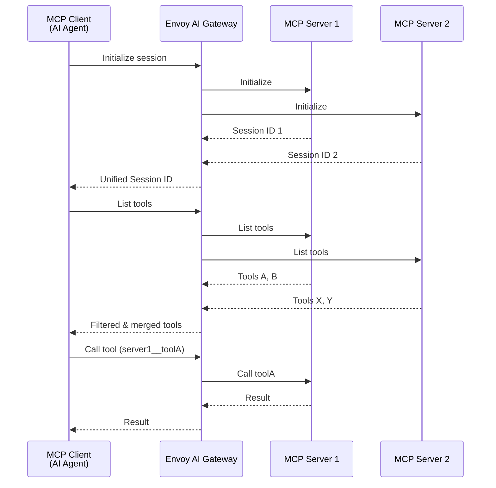
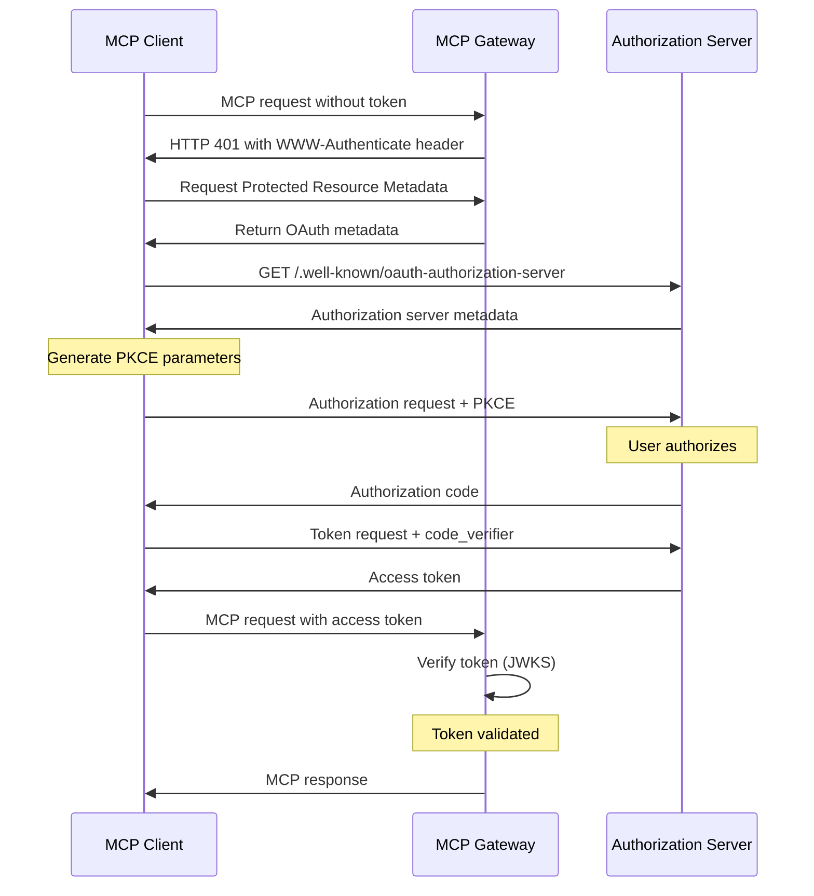

Envoy AI Gateway provides first-class support for [Model Context Protocol](https://modelcontextprotocol.io/) (MCP), enabling AI agents to securely connect to external tools and data sources.

This guide provides an overview of the MCP Gateway capabilities and how to configure routing to MCP servers using the `MCPRoute` API.

## Overview

Envoy AI Gateway's MCP support allows you to:

- **Aggregate multiple MCP servers** into a single unified endpoint
- **Apply security policies** including OAuth authentication, fine-grained access control over the tool access, and upstream API key injection
- **Filter tools** to control which capabilities are exposed to clients
- **Leverage Envoy's networking** for load balancing, rate limiting, circuit breaking, and observability

The MCP Gateway acts as a transparent proxy between MCP clients (AI agents like Claude, Goose, etc.) and backend MCP servers, providing the same production-grade features available for LLM traffic.

## Key Features

| Feature                                | Description                                                                                                                                                                                                                                                         |
| -------------------------------------- | ------------------------------------------------------------------------------------------------------------------------------------------------------------------------------------------------------------------------------------------------------------------- |
| **Streamable HTTP Transport**          | Full support for MCP's streamable HTTP transport, aligning with the [June 2025 MCP spec](https://modelcontextprotocol.io/specification/2025-06-18).<br/>Efficient handling of stateful sessions and multi-part JSON-RPC messaging over persistent HTTP connections. |
| **Fine-Grained Authorization**         | Native enforcement of [OAuth authentication flows](https://modelcontextprotocol.io/specification/2025-11-25/basic/authorization).<br/>Implement granular access control using JWT claims, scopes, and CEL expressions.                                              |
| **Server Multiplexing & Tool Routing** | Route tool calls to the right MCP backends, aggregating and filtering available tools based on gateway policy.<br/>Dynamically merge streaming notifications from multiple MCP servers into a unified interface.                                                    |
| **Upstream Authentication**            | Built-in upstream authentication primitives to securely connect to external MCP servers using API keys and header injection.                                                                                                                                        |
| **Content Filters**                    | Delegate per-backend `tools/call` request and response inspection to an external HTTP service. Supports payload rewrite, source-level exclusions, PII redaction, and hard reject, with configurable timeout and fail-open/fail-closed policy.                       |
| **Full MCP Spec Coverage**             | Complete [June 2025 MCP spec](https://modelcontextprotocol.io/specification/2025-06-18) compliance, including support for tool calls, notifications, prompts, resources, and bi-directional server-to-client requests.                                              |
| **Built-in Observability**             | OpenTelemetry tracing and Prometheus metrics for all MCP requests, using the same observability stack as LLM traffic.                                                                                                                                               |

## Architecture

The MCP Gateway is implemented as a lightweight proxy component within the Envoy AI Gateway sidecar, leveraging Envoy's battle-tested networking stack for all connection handling.



**Key architectural aspects:**

- **Session Management**: The gateway creates unified sessions by encoding multiple backend session IDs, handling reconnection with `Last-Event-ID` support for SSE streams.
- **Notification Handling**: Long-lived SSE streams from multiple MCP servers are merged into a single stream for clients, with proper event ID reconstruction.
- **Request Routing**: Tool names are automatically prefixed with the backend name (e.g., `github__issue_read`) to route calls to the correct upstream server.

For detailed architecture and design decisions, see the [MCP Gateway proposal](https://github.com/envoyproxy/ai-gateway/tree/main/docs/proposals/006-mcp-gateway).

## Trying it out

Before you begin, you'll need to complete the basic setup from the [Basic Usage](/docs/getting-started/basic-usage) guide, which includes installing Envoy Gateway and AI Gateway.

### Basic MCPRoute Configuration

The following example demonstrates a basic `MCPRoute` that proxies the GitHub MCP server:

```yaml
apiVersion: aigateway.envoyproxy.io/v1alpha1
kind: MCPRoute
metadata:
  name: mcp-route
  namespace: default
spec:
  parentRefs:
    - name: aigw-run
      kind: Gateway
      group: gateway.networking.k8s.io
  path: "/mcp" # Clients connect to http://gateway-address/mcp
  backendRefs:
    - name: github
      kind: Backend
      group: gateway.envoyproxy.io
      path: "/mcp/x/issues/readonly"
      securityPolicy:
        apiKey:
          secretRef:
            name: github-token
---
apiVersion: gateway.envoyproxy.io/v1alpha1
kind: Backend
metadata:
  name: github
  namespace: default
spec:
  endpoints:
    - fqdn:
        hostname: api.githubcopilot.com
        port: 443
---
apiVersion: v1
kind: Secret
metadata:
  name: github-token
  namespace: default
type: Opaque
stringData:
  apiKey: ghp_your_token_here
```

Apply this configuration:

```shell
kubectl apply -f mcp-route.yaml
```

Now clients can connect to `http://<gateway-address>/mcp` and access GitHub tools.

### Tool Filtering

Control which tools are exposed using the `toolSelector` field. You can use exact matches or regular expressions:

```yaml
apiVersion: aigateway.envoyproxy.io/v1alpha1
kind: MCPRoute
metadata:
  name: mcp-route
  namespace: default
spec:
  parentRefs:
    - name: aigw-run
      kind: Gateway
      group: gateway.networking.k8s.io
  backendRefs:
    # GitHub: only expose issue-related tools
    - name: github
      kind: Backend
      group: gateway.envoyproxy.io
      path: "/mcp/x/issues/readonly"
      toolSelector:
        includeRegex:
          - .*issues?.* # Matches issue_read, list_issues, etc.
      securityPolicy:
        apiKey:
          secretRef:
            name: github-token

    # Context7: expose specific tools by exact name
    - name: context7
      kind: Backend
      group: gateway.envoyproxy.io
      path: "/mcp"
      toolSelector:
        include:
          - resolve-library-id
          - query-docs
```

:::note
The `toolSelector` field requires exactly one of `include` or `includeRegex` to be specified. If not specified, all tools from the MCP server are exposed.
:::

### Server Multiplexing

The gateway automatically aggregates tools from multiple MCP servers into a single unified interface:

```yaml
apiVersion: aigateway.envoyproxy.io/v1alpha1
kind: MCPRoute
metadata:
  name: mcp-unified
  namespace: default
spec:
  parentRefs:
    - name: aigw-run
      kind: Gateway
      group: gateway.networking.k8s.io
  path: "/mcp"
  backendRefs:
    - name: github
      kind: Backend
      group: gateway.envoyproxy.io
      path: "/mcp/x/issues/readonly"
      securityPolicy:
        apiKey:
          secretRef:
            name: github-token
    - name: context7
      kind: Backend
      group: gateway.envoyproxy.io
      path: "/mcp"
```

Clients will see all tools with prefixed names:

- `github__issue_read`
- `github__list_issues`
- `context7__resolve-library-id`
- `context7__query-docs`

### Header Forwarding

Forward HTTP headers from the client request to specific backend MCP servers. This enables per-user authentication passthrough (e.g., personal access tokens) without requiring OAuth:

```yaml
apiVersion: aigateway.envoyproxy.io/v1alpha1
kind: MCPRoute
metadata:
  name: mcp-unified
  namespace: default
spec:
  parentRefs:
    - name: aigw-run
      kind: Gateway
      group: gateway.networking.k8s.io
  path: "/mcp"
  backendRefs:
    - name: atlassian
      kind: Backend
      group: gateway.envoyproxy.io
      path: "/mcp"
      forwardHeaders:
        - name: X-Atlassian-Jira-Personal-Token
        - name: X-Atlassian-Jira-Url
        - name: Authorization
          backendHeader: X-Original-Auth # optional: rename the header
    - name: github
      kind: Backend
      group: gateway.envoyproxy.io
      path: "/mcp"
      securityPolicy:
        apiKey:
          secretRef:
            name: github-token
```

Each `forwardHeaders` entry specifies:

- `name` (required): The header to extract from the incoming client request.
- `backendHeader` (optional): A different header name to use when forwarding to the backend. If omitted, the original header name is used.

Headers are scoped per-backend — during fan-out operations like `tools/list`, only the backends with explicit `forwardHeaders` configuration receive the forwarded headers. Other backends in the same route are unaffected.

### OAuth Authentication

Protect your MCP Gateway with OAuth authentication following the [MCP Authorization specification](https://modelcontextprotocol.io/specification/2025-06-18/basic/authorization):

```yaml
apiVersion: aigateway.envoyproxy.io/v1alpha1
kind: MCPRoute
metadata:
  name: mcp-route
  namespace: default
spec:
  parentRefs:
    - name: aigw-run
      kind: Gateway
      group: gateway.networking.k8s.io
  backendRefs:
    - name: github
      kind: Backend
      group: gateway.envoyproxy.io
      path: "/mcp/readonly"
  securityPolicy:
    oauth:
      issuer: "https://keycloak.example.com/realms/master"
      audiences:
        - "https://api.example.com/mcp"
      protectedResourceMetadata:
        resource: "https://api.example.com/mcp"
        scopesSupported:
          - "profile"
          - "email"
```

The OAuth flow follows the MCP specification's authorization code flow with PKCE:



### Authorization Policies

Envoy AI Gateway supports fine-grained access control over tool access using a combination of:

- **JWT Scopes & Claims**: Validate standard OAuth2 scopes and custom claims
- **Tool Selection**: Restrict access to specific tools
- **CEL Expressions**: Flexible, advanced matching using Common Expression Language (CEL)

#### Configuration Structure

Authorization is configured in the `MCPRoute` resource under `spec.securityPolicy.authorization`.

```yaml
spec:
  securityPolicy:
    authorization:
      rules:
        - source:
            jwt:
              scopes: ["read"]
          target:
            tools:
              - backend: "github"
                tool: "list_issues"
```

#### Rule Evaluation

Rules are evaluated in order. The first rule that matches the request (Target, Source, and CEL) determines the action (Allow/Deny). If no rules match, the `defaultAction` is applied.

#### Matchers

| Matcher    | Description                                                                                                                                                         |
| ---------- | ------------------------------------------------------------------------------------------------------------------------------------------------------------------- |
| **Target** | Matches specific tools. Can filter by `backend` and `tool` name.                                                                                                    |
| **Source** | Matches JWT properties. <br/>`scopes`: List of required scopes (all must be present).<br/>`claims`: Key-value pairs. Arrays in claims match if _any_ value matches. |
| **CEL**    | Advanced expression evaluated against the request context.                                                                                                          |

#### CEL Context

The following variables are available in CEL expressions:

| Variable              | Description                                    |
| --------------------- | ---------------------------------------------- |
| `request.method`      | HTTP method (e.g., "POST")                     |
| `request.host`        | Host header value                              |
| `request.path`        | URL path                                       |
| `request.headers`     | Map of headers (lowercased keys, single value) |
| `request.auth.jwt`    | Parsed JWT `{claims: ..., scopes: [...]}`      |
| `request.mcp.method`  | MCP JSON-RPC method (e.g., "tools/call")       |
| `request.mcp.backend` | Target backend name                            |
| `request.mcp.tool`    | Target tool name (for tool calls)              |
| `request.mcp.params`  | Parsed JSON-RPC parameters                     |

#### Examples

**Comprehensive Policy Example**

This example demonstrates various matching strategies including token scopes, claims, tool targeting, and CEL expressions.

```yaml
authorization:
  rules:
    - source:
        jwt:
          scopes:
            - echo
      target:
        tools:
          - backend: mcp-backend
            tool: echo
      cel: request.mcp.params.arguments.text.matches("^Hello, .*!$") && request.headers["x-tenant-id"] == "t-123"
    - source:
        jwt:
          scopes:
            - sum
          claims:
            - name: tenant
              valueType: String
              values:
                - acme
                - globex
            - name: org.departments
              valueType: StringArray
              values:
                - engineering
                - development
      target:
        tools:
          - backend: mcp-backend
            tool: sum
```

### Content Filters

Content filters let you delegate per-backend request and response inspection
to an external HTTP service. They are configured on a `MCPRouteBackendRef`
and run at tool-call time, giving the filter the chance to observe, rewrite,
or reject individual `tools/call` payloads without the gateway understanding
the domain-specific shape of the tool.

Typical uses include:

- Injecting source-level exclusions (for example, an `exclude_ticket_ids`
  parameter) so a backend never sees data it should not search.
- Detecting and redacting PII in tool responses before they reach the caller.
- Replacing a raw backend response with a sanitized version (for example,
  a "creation-time" recreation of a ticket rather than its current state).

The filter is invoked separately at each configured scope:

- `Request` &mdash; runs **before** the gateway forwards the tool call to the
  backend. The filter can rewrite the JSON-RPC request or reject the call.
- `Response` &mdash; runs **after** the backend response is received and any
  built-in response modifications have been applied, but before the response
  is written back to the client. The filter can rewrite the JSON-RPC
  response or reject it.

#### Configuration

The filter body is a stable value shape that may be authored in either
of two forms:

1. **Inline form** — `contentFilter: {...}` on `MCPRouteBackendRef`. The
   configuration lives inside the `MCPRoute` spec. Convenient when the
   same team owns both the route and the filter policy.
2. **Standalone form** — a top-level `MCPContentFilter` object whose
   `spec.targetRefs` selects one or more (MCPRoute, backend) pairs.
   Mirrors the Gateway API direct-policy-attachment pattern already
   used by `BackendSecurityPolicy`. Useful when a
   platform/security team owns the filter configuration and
   application teams own the routes, or when one filter should apply
   to many routes/backends.

Both forms produce the same runtime behaviour. When both apply to the
same backend, the **standalone form wins** and the inline value is
ignored. Only one standalone `MCPContentFilter` may target a given
(MCPRoute, backend) pair; conflicting attachments fail the entire
reconcile rather than silently merging.

##### Inline form

```yaml
apiVersion: aigateway.envoyproxy.io/v1alpha1
kind: MCPRoute
metadata:
  name: mcp-route
spec:
  backendRefs:
    - name: supportgpt
      contentFilter:
        url: http://content-filter.mcp.svc.cluster.local:8080/filter
        scopes: [Request, Response]
        timeoutSeconds: 10
        failurePolicy: PassThrough
        forwardHeaders:
          - x-request-id
          - x-tenant-id
```

##### Standalone form

```yaml
# Route + backends carry no inline filter config.
apiVersion: aigateway.envoyproxy.io/v1alpha1
kind: MCPRoute
metadata:
  name: mcp-route
  namespace: default
spec:
  backendRefs:
    - name: supportgpt
---
# Filter body lives on its own object, selecting the route + backend
# above via targetRefs. sectionName pins the attachment to a specific
# backend; omit sectionName to apply route-wide (every backend).
apiVersion: aigateway.envoyproxy.io/v1alpha1
kind: MCPContentFilter
metadata:
  name: supportgpt-filter
  namespace: default
spec:
  targetRefs:
    - group: aigateway.envoyproxy.io
      kind: MCPRoute
      name: mcp-route
      sectionName: supportgpt
  url: http://content-filter.mcp.svc.cluster.local:8080/filter
  scopes: [Request, Response]
  timeoutSeconds: 10
  failurePolicy: PassThrough
  forwardHeaders:
    - x-request-id
    - x-tenant-id
```

The `MCPContentFilter` object must live in the **same namespace** as
the `MCPRoute` it targets — it is a direct policy attachment, not a
cross-namespace reference.

| Field                      | Description                                                                                                                                                                                                                                                                                                                                                                                                                                                                       |
| -------------------------- | --------------------------------------------------------------------------------------------------------------------------------------------------------------------------------------------------------------------------------------------------------------------------------------------------------------------------------------------------------------------------------------------------------------------------------------------------------------------------------- |
| `url`                      | HTTP endpoint of the filter service. Must use `http://` or `https://`.                                                                                                                                                                                                                                                                                                                                                                                                            |
| `scopes`                   | One or both of `Request` and `Response`. The filter is only invoked at the scopes listed here.                                                                                                                                                                                                                                                                                                                                                                                    |
| `timeoutSeconds`           | Per-invocation timeout (default `10`, max `120`).                                                                                                                                                                                                                                                                                                                                                                                                                                 |
| `failurePolicy`            | `PassThrough` (default, fail-open) forwards the unmodified payload when the filter is unreachable, returns non-2xx, returns malformed JSON, or exceeds `timeoutSeconds`. `Fail` (fail-closed) aborts the call with JSON-RPC error `-32011`. `reject` from the filter always aborts the call with `-32010`, regardless of policy. Every failure increments `mcp_filter_status_total{status="failed-open"\|"unavailable"}`; page on sustained rates even when configured fail-open. |
| `forwardHeaders`           | Optional list of client-request header names (case-insensitive, at most 16 entries) copied into the filter request. **SECURITY:** each entry is sent verbatim to the filter host and its observers — NEVER list `Authorization`, `Cookie`, `Proxy-Authorization`, or any header carrying a bearer token or session identifier unless the filter is explicitly in-scope for handling those secrets. Prefer opaque IDs (request ID, tenant ID, evaluation ticket ID).               |
| `mode`                     | `Enforce` (default) applies the filter verdict. `Shadow` invokes the filter but always forwards the ORIGINAL body; verdicts are recorded via `X-Content-Filter-Status`, `mcp_filter_decisions_total`, and redaction audit events.                                                                                                                                                                                                                                                 |
| `enabled`                  | Per-backend kill switch (default `true`). Setting `false` skips the filter entirely and emits `X-Content-Filter-Status: disabled`. Configuration is preserved for easy re-enable.                                                                                                                                                                                                                                                                                                 |
| `shadowSampleRatePermille` | Sampling budget in permille (0..1000, default `1000`). Applies only when `mode: Shadow`. Values below 1000 cap LLM cost; invocations that are not sampled record `action=shadow_sampled_out` and skip the filter call.                                                                                                                                                                                                                                                            |

#### Safe rollout: shadow mode, kill switches, sampling

The filter supports a full progressive-delivery lifecycle without any
external rollout tooling:

1. **Shadow mode** (`mode: Shadow`). The filter is invoked on every
   eligible call but the gateway always forwards the ORIGINAL body to
   the client. The verdict is recorded as
   `action=shadow_would_{pass,redact,reject,fail}` on the
   `mcp_filter_decisions_total` counter and on the
   `X-Content-Filter-Status` header. Use shadow mode to measure
   false-positive / false-negative rates on real traffic before
   committing to enforcement.

2. **Sample rate** (`shadowSampleRatePermille`). Bounds how many
   shadow-mode calls are actually sent to the filter. Expressed in
   permille (parts per thousand) so 0.1% granularity is cheap:
   `shadowSampleRatePermille: 100` means 10% of eligible calls hit
   the filter, the remaining 90% short-circuit with
   `action=shadow_sampled_out`. Ignored in enforce mode; enforcing a
   sampled fraction would leak content intermittently.

3. **Per-backend kill switch** (`enabled: false`). Stops filtering on
   a single backend without editing the rest of the route. Config is
   preserved so re-enabling is one `kubectl edit` away.

4. **Cluster-wide kill switch** (`MCPContentFilterPolicy.globalDisable`).
   Lives in the process-wide ConfigMap (see
   `internal/filterapi/mcp_content_filter_policy.go`). Flipping it to
   `true` disables every filter on every backend in the cluster —
   the intended knob for incident response.

All four knobs hot-reload through the controller's CRD watch and the
gateway's atomic config pointer swap; changing any of them does NOT
require a gateway pod restart.

```yaml
# Shadow rollout at 10% sampling
- name: supportgpt
  contentFilter:
    url: http://content-filter.mcp.svc.cluster.local:8080/filter
    scopes: [Response]
    mode: Shadow
    shadowSampleRatePermille: 100
    enabled: true
```

```yaml
# Production enforcement with fail-closed (unscanned == no response)
- name: supportgpt
  contentFilter:
    url: http://content-filter.mcp.svc.cluster.local:8080/filter
    scopes: [Response]
    mode: Enforce
    failurePolicy: Fail
    enabled: true
```

See [`examples/content-filter/`](https://github.com/envoyproxy/ai-gateway/tree/main/examples/content-filter)
for example manifests: `MCPRoute` with the inline filter shape in both
shadow and enforce modes (`gateway-route-shadow.yaml`,
`gateway-route-enforce.yaml`), top-level `MCPContentFilter` objects in
both backend-scoped and route-wide variants
(`gateway-route-standalone.yaml`), and the `MCPContentFilterPolicy`
cluster-wide kill-switch ConfigMap (`global-kill-switch.yaml`). The
reference filter service itself (LLM-powered evaluation-mode redactor)
lives with `panacea-agent` under `services/aigw-content-filter-dispatcher/`.

#### Wire Protocol

The gateway `POST`s a JSON envelope to the filter URL and expects a JSON
envelope back. The body of the tool call is base64-encoded so it can carry
arbitrary byte sequences without re-encoding.

Request (gateway &rarr; filter):

```json
{
  "route": "mcp-route",
  "backend": "supportgpt",
  "scope": "Request",
  "mcpMethod": "tools/call",
  "tool": "lookup",
  "headers": { "x-tenant-id": "acme" },
  "bodyBase64": "eyJqc29ucnBjIjoiMi4wIiwgLi4uIH0=",
  "contentType": "application/json"
}
```

Response (filter &rarr; gateway):

```json
{
  "action": "redact",
  "bodyBase64": "eyJqc29ucnBjIjoiMi4wIiwgLi4uIH0=",
  "reason": "removed PII from result"
}
```

`action` must be one of `pass`, `redact`, or `reject`. `redact` requires a
`bodyBase64` replacement; `reject` optionally carries a `reason` string that
is surfaced to the caller via the JSON-RPC error envelope.

The gateway emits two dedicated JSON-RPC error codes back to the MCP client
on filter-related aborts:

| Code     | When it is emitted                                                                                                                                                                                                                                                                                               |
| -------- | ---------------------------------------------------------------------------------------------------------------------------------------------------------------------------------------------------------------------------------------------------------------------------------------------------------------- |
| `-32010` | The filter returned `action: reject` (either request- or response-scope). The filter's `reason` is surfaced in the error message. The gateway always honours a reject regardless of `failurePolicy`.                                                                                                             |
| `-32011` | The filter could not be consulted (connection refused, non-2xx, malformed body, timeout) AND `failurePolicy: Fail` was configured. The gateway refuses to serve unscanned content and aborts the call. With the default `failurePolicy: PassThrough` the gateway silently forwards the original payload instead. |

Both codes fall inside the MCP implementation-defined range and are
stable across gateway releases. Clients can rely on them to distinguish
"the filter decided no" (-32010, user-visible policy violation) from
"the filter was broken" (-32011, operator-visible infrastructure issue).

## See Also

- [MCP Gateway Proposal](https://github.com/envoyproxy/ai-gateway/tree/main/docs/proposals/006-mcp-gateway) - Detailed architecture and design decisions
- [MCP Specification](https://modelcontextprotocol.io/specification/2025-06-18) - Official Model Context Protocol documentation
- [MCP Example](https://github.com/envoyproxy/ai-gateway/tree/main/examples/mcp) - Complete working example
- [CLI MCP Configuration](/docs/cli/aigwrun#mcp-configuration) - Using MCP with `aigw run` standalone mode
